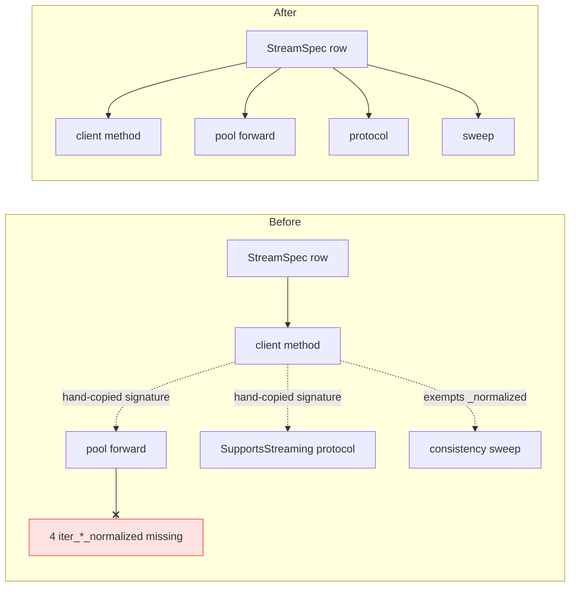
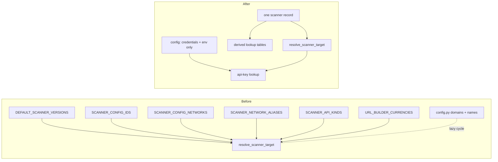
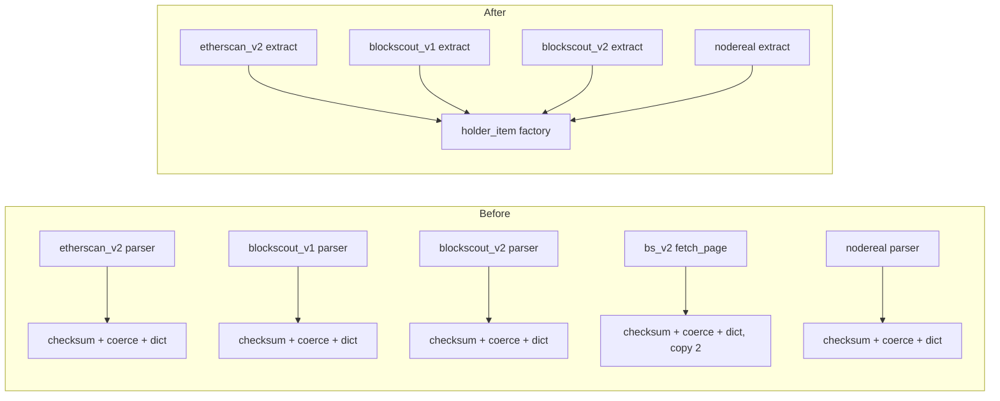
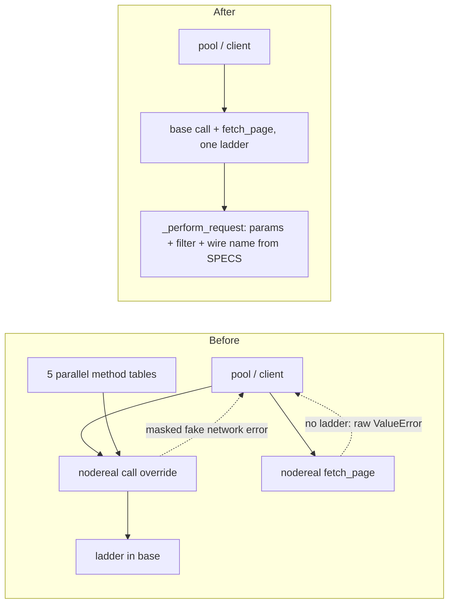
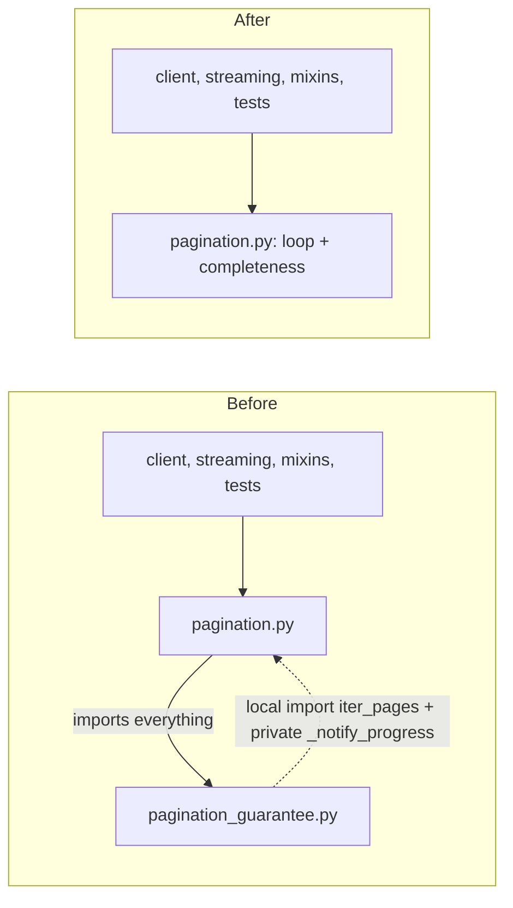
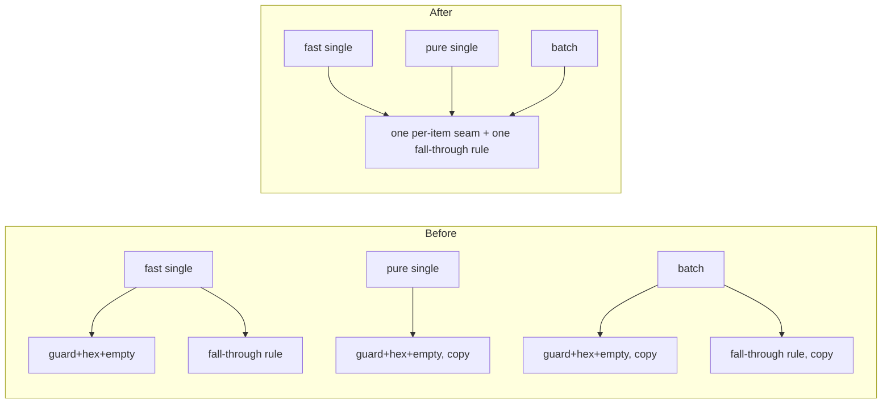
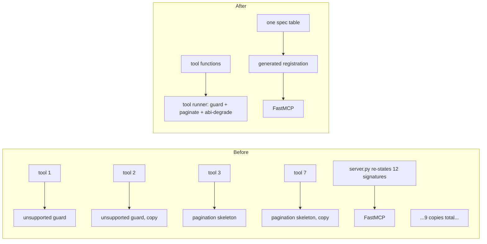
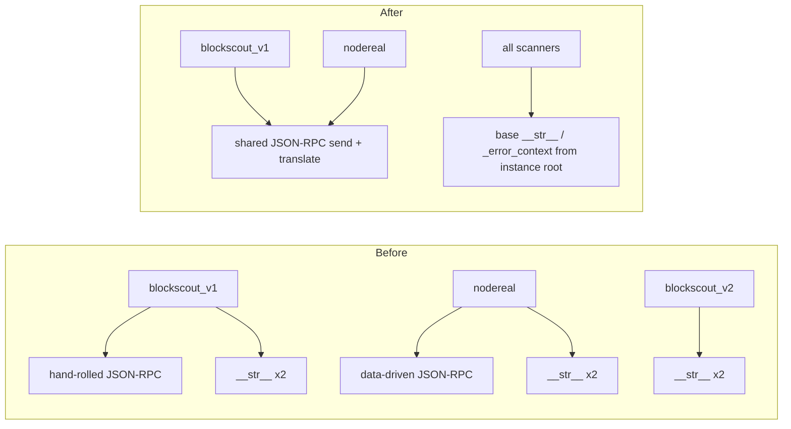

# Architecture review — aiochainscan, 2026-09-03

**Read:** `aiochainscan/core/` (client, pool, streaming, mixins), `aiochainscan/scanners/`, `aiochainscan/services/pagination*.py`, `aiochainscan/chain_registry.py`, `aiochainscan/config.py`, `aiochainscan/decode.py`, `aiochainscan/mcp/`, weighted by the 60-commit hot spots (scanners, pool, decode, config, mcp/tools).
**Not read:** `fastabi/src/lib.rs` (separate distribution, version-gated), `adapters/` + `ports/` (stable, real adapters already exist), `domain/`, `utils/`, `cli.py` — no churn.
**Grounding:** `CONTEXT.md` (Scanner, EndpointSpec, Page cursor, Pagination engine, ScannerTarget, Streaming aggregation), `AGENTS.md` architecture contract ("the base owns the seams — do NOT override `call()`"; the `InputLimitExceededError` failure-kind placement note). No `docs/adr/` exists yet.

## C1 — Derive the pool's streaming surface from `STREAMING_SPECS` · Strong

**Status: done** — brief [briefs/C1-derive-pool-streaming-surface.md](briefs/C1-derive-pool-streaming-surface.md); merged to `main` as `369240d` (2026-09-03), gate PASS-WITH-FINDINGS (LOW only).

**Files**
- `aiochainscan/core/pool.py:742-952` (seven hand-written stream forwards + `_forward_stream`)
- `aiochainscan/core/pool.py:956-1104` (DataFrame duplicates, identity/classmethod delegation)
- `aiochainscan/core/client.py:704,774,844,925` (`iter_*_normalized` — missing from the pool)
- `aiochainscan/core/mixins/account.py:313-330` (crash site), `mixins/logs.py:113-137`
- `aiochainscan/core/streaming.py:241-270` (`StreamSpec`), `414-543` (`SupportsStreaming` protocol)
- `tests/test_method_consistency.py:387` (sweep exemption), `249-252` (test double stubs the missing methods)

**Problem**
`ChainscanPool` promises the full `ChainscanClient` surface and delivers it two ways: single-shot
methods come free because the pool re-composes the same ten mixins (`pool.py:255-266`), but the
streaming surface is hand-forwarded — ~170 lines restating each client signature verbatim
(e.g. `iter_logs`'s 7 params at `pool.py:806-816` vs `client.py:1037-1047`) plus ~100 lines of
one-line identity delegation. Roughly 27% of the file exists to re-declare the client's
interface. The interface is maintained in two places, sync'd by a test — and the sync has
**already failed**: the four `iter_*_normalized` methods (`client.py:704/774/844/925`) have no
pool counterpart (`grep _normalized pool.py` → 0 hits), while the pool inherits the mixin
aggregators that call them — `pool.get_all_transactions_normalized(addr)` raises
`AttributeError` at `account.py:319` today, and the same crash awaits three more public pool
methods. The consistency sweep cannot catch it: it exempts names ending `_normalized`
(`test_method_consistency.py:387`) and stubs exactly those methods onto its test double
(`:249-252`), so the missing pool surface is invisible by construction.

**Deletion test**
Delete the hand-written forwards: their complexity does **not** reappear across callers — every
fact a forward restates (method name, kwargs, flags) is already carried by the `StreamSpec` row
that drives the client body and the sweep. The forwards are pass-throughs. This is the clean
positive verdict.

**Deepening**
The `StreamSpec` row becomes the one declaration of a stream's shape: the client method, the
pool forward, the `SupportsStreaming` protocol entry and the sweep derive from it. The
`iter_*_normalized` twins become rows (or derive from their stream rows), which deletes the
sweep exemption instead of documenting it.

**Interface after** (shape, not final signatures)
- pool and client expose identical streaming surfaces **by construction** — one row per stream
- adding a stream = one registry row; zero hand-synced signatures anywhere
- `_forward_stream`'s pinning/cooldown behavior is implementation, stays hand-written

**Verification**
`uv run pytest tests/test_method_consistency.py tests/test_provider_pool.py -q`; plus two new
tests: a surface-parity test (public async methods and async generators of `ChainscanClient`
must exist on `ChainscanPool`) and a regression test driving
`pool.get_all_transactions_normalized` against a stubbed member client.

**Wins**
- locality: a stream's shape lives in one row, not in client + pool + protocol + sweep table
- leverage: one declaration, four consumers
- fixes four public pool methods that crash today; removes ~270 lines of forwarding

**Risks / out of scope**
Generated methods must remain typed and discoverable — `mypy --strict` and IDE introspection
must still see real signatures and docstrings; if generation fights the type checker, fall back
to deriving only the forwards' *bodies* from the row. The pool's routing engine
(`_execute`/`_pinned_stream`/`_guaranteed_pinned_stream`, `pool.py:489-686`) is deep and stays
hand-written. Do not touch `SupportsStreaming` consumers outside `core/`.

**ADR**
None.

**Before / after**

## C2 — One per-scanner record in `chain_registry`; `config` derives · Strong

**Status: accepted** — brief [briefs/C2-one-scanner-record.md](briefs/C2-one-scanner-record.md).

**Files**
- `aiochainscan/chain_registry.py:472-561` (seven name-keyed satellite tables)
- `aiochainscan/chain_registry.py:87-107` (instance hosts; zksync silently dropped)
- `aiochainscan/chain_registry.py:113-251` (`get_url_builder_profile`, 11 code branches)
- `aiochainscan/chain_registry.py:817-846` (`get_scanner_network_name`) and `core/client.py:246-249` (its only caller)
- `aiochainscan/config.py:256-260,527` (lazy imports of the registry), `278-335` (duplicate domains and hand-copied display names)
- `aiochainscan/chain_registry.py:10,588-605` (registry imports config for credentials)

**Problem**
Adding or altering a scanner or network touches three to seven parallel tables keyed by scanner
name, spread over two modules that import each other lazily in both directions
(`config.py:256/527` ⇄ `chain_registry.py:10`). Nothing checks the tables agree, and the two
failure modes are both live: a BlockScout instance listed in `BLOCKSCOUT_INSTANCE_HOSTS`
(`:87-100`, 12 rows) is **silently dropped** from `BLOCKSCOUT_HOSTS` (`:103-107`) if its
`blockscout_*` key is missing from `URL_BUILDER_CURRENCIES` — zksync is dropped today — and a
host that survives the filter hits a bare `KeyError` in `config.py:331` against the
hand-copied 10-entry display-name dict (`config.py:316-327`). Provider domains are stated
twice (`config.py:278-312` vs `get_url_builder_profile` hosts). `get_url_builder_profile` is
an 11-branch chain in which two families are data-driven and nine providers are code. And the
`ScannerTarget` contract "the client trusts the target and never re-derives"
(`chain_registry.py:624-628`) is broken once: `core/client.py:246` calls a second translation,
`get_scanner_network_name` — the fourth copy of ethereum-naming knowledge inside one module.

**Deletion test**
Delete the seven satellite tables: the complexity reappears **once**, as fields of one record,
instead of seven keyed columns in two files. The tables are shallow — the interface (keyed
lookup) is nearly as wide as the implementation (the entries themselves). Positive verdict.

**Deepening**
One frozen per-scanner record — kind, default version, config id, network aliases, api kind,
hosts, custom-URL support, display name — from which the lookup tables derive at import, with
construction-time validation replacing both silent failure modes. `ScannerTarget` carries
`scanner_network` (delete `get_scanner_network_name` and the client's re-derivation). The
config ⇄ registry cycle breaks by moving the `V2_QUERY_AUTH_API_KINDS` fallback
(`config.py:527`) into the registry and leaving `config.py` with credential/env resolution and
display concerns only.

**Interface after** (shape)
- `resolve_scanner_target()` unchanged — it is already the deep entry point
- one record per scanner; "where do I add a provider" has one answer
- drift between instance hosts, currencies and display names becomes an import-time error

**Verification**
`uv run pytest tests/test_config.py tests/test_scanner_target.py -q`, then `make ci-local`;
plus a new test asserting every `BLOCKSCOUT_INSTANCE_HOSTS` alias either resolves to a
constructible scanner or fails loudly at import.

**Wins**
- locality: every fact about a scanner lives in one record
- the two silent drift modes (dropped instance, `KeyError` on missing name) become impossible
- leverage: `MCP _SCANNER_HINTS` and `config` display names can read the same record later

**Risks / out of scope**
`config.py` credential resolution was just unified (merge `ead01d7`) — do not touch the
env-var priority order. Credential lookup stays delegated from registry to config
(`chain_registry.py:588-605`); invert only the topology direction. Display names are UX —
keep the strings, move their home.

**ADR**
None.

**Before / after**

## C3 — Give the token-holder item contract one owner · Strong

**Status: accepted** — brief [briefs/C3-holder-item-one-owner.md](briefs/C3-holder-item-one-owner.md).

**Files**
- `aiochainscan/scanners/etherscan_v2.py:26-59`
- `aiochainscan/scanners/blockscout_v1.py:44-67`
- `aiochainscan/scanners/blockscout_v2.py:112-141` and `:607-608` (second application)
- `aiochainscan/scanners/nodereal.py:176-198`
- `aiochainscan/scanners/base.py:51-58` (`checksummed_holder_address` — already shared)

**Problem**
`TOKEN_HOLDERS` is the one `Method` with a normalized cross-scanner item shape
(`{'address': EIP-55 str, 'value': str}` — documented in `AGENTS.md` and `CONTEXT.md` as a
deliberate contract), and that contract has **four owners**. Each parser re-implements the
same tail — checksum the address, coerce the quantity to `str`, build the dict — and each
docstring points at the others as the reference ("matching `etherscan_v2._parse_token_holders`
/ `blockscout_v2._normalize_token_holder_entry` exactly", `nodereal.py:182-184`). A fifth
scanner hand-copies it again; a drift in one silently forks the shape. BlockScout V2 applies
its normalization twice — the SPECS parser on the `call()` path (`:127-141`) and inline again
in `fetch_page` (`:607-608`, with a comment admitting the duplication) — so one endpoint's
extraction exists in two code paths that can drift independently.

**Deletion test**
Delete the shared tail of the four parsers: it reappears in four files — the contract's real
cost today. Concentrated in one factory next to `checksummed_holder_address`, it earns one
owner. Positive verdict.

**Deepening**
One `holder_item(address, value)` factory on `scanners/base.py` beside
`checksummed_holder_address`; each parser keeps only its provider-specific field extraction;
BlockScout V2's `fetch_page` reuses the spec parser so the endpoint has one extraction.

**Interface after** (shape)
- scanners map provider fields → factory call; the item shape is defined and tested at one seam
- a new scanner gets the contract by importing, not by copying a docstring reference

**Verification**
`uv run pytest tests/test_token_holders.py tests/test_nodereal_holders.py -q` (both pin the
item shape today).

**Wins**
- locality: a shape bug is fixed once, not four times
- leverage: the documented "ONE normalized shape" finally has one implementation
- deletes BlockScout V2's double parse

**Risks / out of scope**
Keep each parser's provider-specific lenience (junk fields differ per provider) in the
extraction, not the factory. Do not touch `TOKEN_TOP_HOLDERS` ordering semantics or the
holder-count parsing.

**ADR**
None.

**Before / after**

## C4 — Bring NodeReal's transport back inside the base seams · Worth exploring

**Status: done** — merged to `main` (2026-09-03), gate PASS-WITH-FINDINGS (LOW only). — brief [briefs/C4-nodereal-inside-base-seams.md](briefs/C4-nodereal-inside-base-seams.md).

**Files**
- `aiochainscan/scanners/nodereal.py:1047-1052` (`call()` override)
- `aiochainscan/scanners/nodereal.py:1050-1051` vs `:1171` (transfer filter applied at two seams)
- `aiochainscan/scanners/nodereal.py:1054-1087` (`fetch_page` without the error ladder; contrast `blockscout_v2.py:600`)
- `aiochainscan/scanners/nodereal.py:347-349,352-357,360-368,456` (bare `ValueError` validations)
- `aiochainscan/scanners/base.py:87-88` (the masking ladder), `:331-361` (hook contract)
- `aiochainscan/scanners/nodereal.py:548-572` (`_WIRE_METHODS`, parallel to `SPECS` `:581-829`)

**Problem**
Three linked lapses, all in the one scanner that most needs the base seams:
1. NodeReal overrides `call()` (`:1047-1052`) purely to post-filter transfer results — the
   exact anti-pattern `AGENTS.md` names ("do NOT override `call()`"), and the reason the filter
   needs a second copy on the pagination path (`:1171`).
2. Its `fetch_page` (`:1054-1087`) applies **no** error ladder, unlike BlockScout V2's
   (`:600`). Same malformed input therefore raises a bare `ValueError` from `fetch_page()` but
   a masked fake `ChainscanNetworkError(retryable=False)` from `call()` (via `base.py:87-88`).
   Divergent exception identity for the same caller mistake — and the pool's failure
   classification misreads caller bugs as provider faults and cools healthy providers, the
   exact failure mode `AGENTS.md` documents as load-bearing for `InputLimitExceededError`.
3. `_WIRE_METHODS` (`:548-572`) is a full dict keyed identically to `SPECS` — with
   `TRANSFER_CATEGORIES`, `CURSOR_KEYS` and the dispatch sets, one method is declared in up to
   five parallel places inside the class; a mismatch compiles and dispatches wrong.

**Deletion test**
The `call()` override passes — its complexity already exists at `:1171`. `_WIRE_METHODS`
passes — the spec's deliberately-unused `path` slot can carry the wire name. Both are
pass-throughs over facts declared elsewhere. Positive verdict on both.

**Deepening**
Move `_filter_transfer_items` into `_perform_request` (which receives method and params);
wrap the `fetch_page` body in `translate_unexpected_errors`; raise a `ChainscanClientError`-
family exception at the four validation sites; fold the JSON-RPC wire names into `SPECS`.

**Interface after** (shape)
- NodeReal overrides only the sanctioned dialect hooks; the base-class contract regains zero
  counterexamples
- a bad argument raises the same fatal exception from `call()` and `fetch_page()`, and the
  pool classifies it `FATAL`
- adding a NodeReal method touches `SPECS` alone

**Verification**
`uv run pytest tests/test_nodereal.py tests/test_nodereal_holders.py -q`; plus a new test:
invalid `closest=` raises the client-error family from **both** `call()` and `fetch_page()`,
and `classify_failure` reads it as `FATAL`.

**Wins**
- locality: one filter site, one ladder, one method declaration per endpoint
- correctness: no more fake network errors for caller mistakes, no divergent exception identity

**Risks / out of scope**
Exception identity is observable behavior — changelog-worthy. The 1000-block window walk
(`:1093-1188`) stays scanner-local **by documented design** — do not push it below the
pagination seam. `EtherscanLikeScanner` and its input-limit placement are untouched.

**ADR**
None.

**Before / after**

## C5 — Merge the pagination-guarantee module into the engine · Worth exploring

**Status: done** — brief [briefs/C5-merge-pagination-guarantee.md](briefs/C5-merge-pagination-guarantee.md); merged to `main` (2026-09-03), gate PASS-WITH-FINDINGS.

**Files**
- `aiochainscan/services/pagination.py:54-80` (imports everything from `pagination_guarantee`, re-exports)
- `aiochainscan/services/pagination_guarantee.py:231,291` (local imports back — including the private `_notify_progress`)
- `tests/test_normalized_streaming.py` (the only importer of `pagination_guarantee` outside the pair)

**Problem**
The split pretends a seam that does not exist. `pagination.py` re-exports the whole of
`pagination_guarantee`; `pagination_guarantee` imports `iter_pages` and the private
`_notify_progress` back **inside function bodies** to break the cycle; and no production code
imports `pagination_guarantee` directly — every consumer already goes through
`services.pagination`. It is the bottom half of one engine wearing a module boundary.

**Deletion test**
Delete `pagination_guarantee.py` as a module: nothing reappears — its contents move one file
over and the cycle-local imports vanish. Positive verdict (merge, not restructure).

**Deepening**
Merge into `pagination.py` — one cursor loop, one completeness branch, one module docstring
telling the whole guarantee story. This *aligns* the code with `CONTEXT.md`, which already
names `pagination.py` as the home of the "Pagination engine".

**Interface after** (shape)
- `services.pagination` remains the only import name; its `__all__` is unchanged (the
  re-exported names just live there)
- the private-symbol local imports disappear

**Verification**
`uv run pytest tests/test_pagination_engine.py tests/test_pagination_guarantee.py tests/test_normalized_streaming.py -q`
(update the one direct import in `test_normalized_streaming.py`).

**Wins**
- locality: the completeness story (overflow detection, adaptive split, both terminal errors)
  reads in one file instead of two halves of a cycle
- an honest seam list: the module's dependencies stop lying about its independence

**Risks / out of scope**
Git-blame churn only. `iter_pages`' cursor loop (`pagination.py:298-334`) and
`split_window`'s observed-boundary recursion (`pagination_guarantee.py:141-166`) are deep —
move them verbatim, edit nothing inside them.

**ADR**
None.

**Before / after**

## C6 — One decode seam for the single and batch paths · Worth exploring

**Status: accepted** — brief [briefs/C6-one-decode-seam.md](briefs/C6-one-decode-seam.md).

**Files**
- `aiochainscan/decode.py:384-385` vs `:753-755` (fastabi→floor fall-through implemented twice)
- `aiochainscan/decode.py:361-364,403-406,723` (input-length guard ×3), `:369-370,725-726` (hex strip ×2), `:391,765` (exception tuple ×2), empty-mark assignment ×6
- `aiochainscan/decode.py:374` vs `:274` (ABI re-serialized per call though the index already serialized it for the digest)
- `aiochainscan/decode.py:157-185` (six fastabi bindings with zero callers: `decode_many_direct/flat/hex/raw`, `decode_one`, `decode_one_direct`)
- `tests/test_decode.py:200-509` (17 patches of private internals)

**Problem**
Three entry points (fast single, pure single, batch) each restate "what a non-decodable
transaction looks like". The subtlest rule in the file — fall through to the pure floor only
when the ABI declares the selector — has two copies that can drift, and a tier-parity fix must
be applied twice. The fast path re-serializes the ABI to JSON on every call although
`_abi_index` already computed that exact serialization for its digest. Six dead bindings
widen the module's interface with a backend contract nothing exercises. The tests pay for it:
`test_decode.py` patches private internals 17 times, while `test_abi_pure.py` proves the same
coverage is reachable through public behavior.

**Deletion test**
The five dead bindings pass trivially (zero callers in package and tests). The duplicated
fragments pass — one per-item seam concentrates them; the complexity does not reappear across
callers because there is exactly one caller of each path.

**Deepening**
One per-item seam — length guard, hex strip, empty-mark, fall-through-gated-on-selector — that
all three entry points call; `_AbiIndex` carries the serialized ABI string; delete the dead
bindings.

**Interface after** (shape)
- public names unchanged; the fall-through rule has one owner
- batch tests drive `decode_transaction_input(s)` behavior only; the private patches melt

**Verification**
`uv run pytest tests/test_decode.py tests/test_abi_pure.py -q` (tier-parity included); run
`tests/test_abi_pure.py -m benchmark` before/after — the hot path has measured costs recorded
in `AGENTS.md` and must not regress.

**Wins**
- locality: a parity fix lands once
- test surface: 17 private patches → public-behavior tests
- removes per-call ABI serialization the index was built to avoid

**Risks / out of scope**
The batch whole-batch fallback (`:765-767`) re-decodes items after a late failure — preserve
its exact semantics while consolidating. Do not touch `abi_pure.py` (deep, best-tested module
in the package).

**ADR**
None.

**Before / after**

## C7 — Generate the MCP tool layer from one spec · Worth exploring

**Status: accepted** — brief [briefs/C7-generate-mcp-tool-layer.md](briefs/C7-generate-mcp-tool-layer.md).

**Files**
- `aiochainscan/mcp/tools.py:464-470,512-517,637-642,682-687,749-754,836-841,880-885,956-961,1028-1033` (unsupported-method guard ×9)
- `aiochainscan/mcp/tools.py:472-490,644-663,764-816` (paginated-tool skeleton ×3)
- `aiochainscan/mcp/tools.py:609-617,887-907,963-979` (ABI fetch-parse-degrade ×3), `:774-783,847-856` (holder curation ×2)
- `aiochainscan/mcp/server.py:96-258` (~165 lines restating every tool signature for FastMCP)
- `aiochainscan/mcp/tools.py:129` (ClientPool keyed on the caller's chain spelling)

**Problem**
Twelve tools hand-roll the same three shapes: the ~6-line unsupported-method response appears
nine times; `read_contract` needed it **twice** (ABI and eth_call are separate capabilities) —
evidence the shape does not compose; three paginated tools repeat the same 20-line
cursor-merge-fetch-curate-notify sequence; the ABI degrade note exists with three slightly
different messages. `server.py` restates every tool's parameter list for FastMCP, so each
parameter lives in two files and drift is invisible until an agent passes one the other
doesn't accept. And `ClientPool` keys connections on whatever string the agent typed
(`'eth'` vs `'ethereum'` vs `1`), so aliases of one chain open parallel pools in a long-lived
server.

**Deletion test**
The `server.py` re-statements pass — they are pass-throughs to the `tools.py` functions with
signatures copied; a registration table (name, function, schema) replaces them wholesale. The
tools' repeated shapes pass a softer test: deleting the copies concentrates ~120 lines into
one runner without the complexity reappearing per tool.

**Deepening**
One tool-runner step kit (unsupported guard, paginated fetch, ABI degrade) that tool functions
compose; `server.py` registers from one spec table; canonicalize the network through
`resolve_scanner_target` before pooling clients.

**Interface after** (shape)
- adding a tool = one plain function + one table row (functions stay plain and
  offline-testable — the runner wraps, never absorbs)
- the fourth paginated tool is a row, not a copy
- MCP wire contract unchanged

**Verification**
`uv run --extra mcp pytest tests/test_mcp_server.py -q` — the offline tool tests call
`tools.py` functions directly and must stay green without modification.

**Wins**
- leverage: guard/cursor/curation policy changes land once
- locality: curation caps and degrade messages stop existing in threes
- connection pooling stops being agent-spelling-dependent

**Risks / out of scope**
FastMCP introspects signatures and docstrings for tool schemas — generated registrations must
preserve both exactly. Keep the existing derived cursor whitelist (`scanner_cursor_keys`)
untouched; it is the pattern this candidate imitates.

**ADR**
None.

**Before / after**

## C8 — A shared JSON-RPC kit and base defaults for scanner boilerplate · Speculative

**Status: done** — merged to `main` (2026-09-03), gate PASS-WITH-FINDINGS (MEDIUM closed by orchestrator). — brief [briefs/C8-scanner-base-dialect-kit.md](briefs/C8-scanner-base-dialect-kit.md).

**Files**
- `aiochainscan/scanners/blockscout_v1.py:211-244` (hand-rolled JSON-RPC) vs `aiochainscan/scanners/nodereal.py:877-900` (data-driven JSON-RPC)
- `aiochainscan/scanners/base.py:609-619`, `blockscout_v1.py:246-258`, `blockscout_v2.py:658-668`, `nodereal.py:1235-1245` (`__str__`/`__repr__` ×4 classes)
- `aiochainscan/scanners/base.py:464-466` vs `blockscout_v1.py:186-187`, `blockscout_v2.py:571-572`, `nodereal.py:1011-1012` (`_error_context` overrides)

**Problem**
The JSON-RPC dialect has two implementations with different machinery — a third JSON-RPC
explorer re-invents a third. Six `__str__` methods restate "the instance root". Two of the
three `_error_context` overrides produce **worse** messages than the default they replace:
both drop the `method` argument the default included (`blockscout_v1.py:186-187`,
`blockscout_v2.py:571-572` — the parameter is unused).

**Deletion test**
The `__str__`/`_error_context` overrides pass — a base default fed by one instance-root
attribute replaces all of them and their complexity vanishes. The JSON-RPC kit is genuinely
two-adapter (the seam is real) but the two implementations differ enough that unification is
unproven — hence Speculative.

**Deepening**
Base `Scanner` gains an instance-root attribute feeding default `__str__`/`_error_context`
(keeping the method name in every message); optionally a shared JSON-RPC send+translate
helper both dialect scanners use.

**Verification**
`uv run pytest tests/test_blockscout_v1_ethrpc.py tests/test_nodereal.py -q`.

**Wins**
- locality: error-message quality is decided once, at the base

**Risks / out of scope**
Mostly cosmetic churn; do it alongside C4 (same file for NodeReal) or not at all.

**ADR**
None.

**Before / after**

## Top recommendation

**C1.** It is the only candidate with a defect shipping today (four public `ChainscanPool`
methods raise `AttributeError`), its deletion test comes back cleanest (the registry already
carries every fact the hand-written forwards restate), the deepening is contained in
`core/`, and half the machinery (`STREAMING_SPECS`, `_forward_stream`) already exists.
