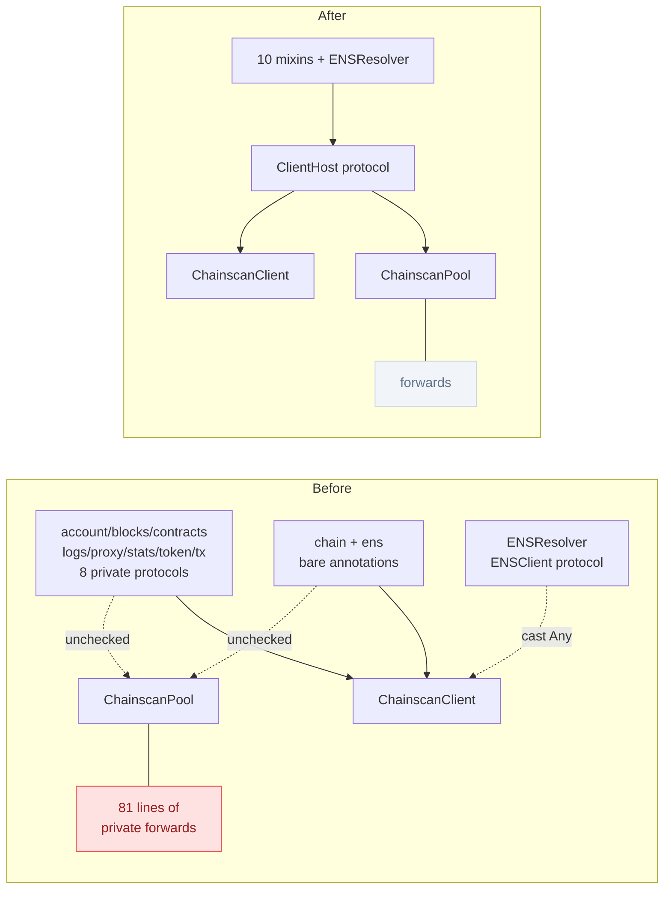
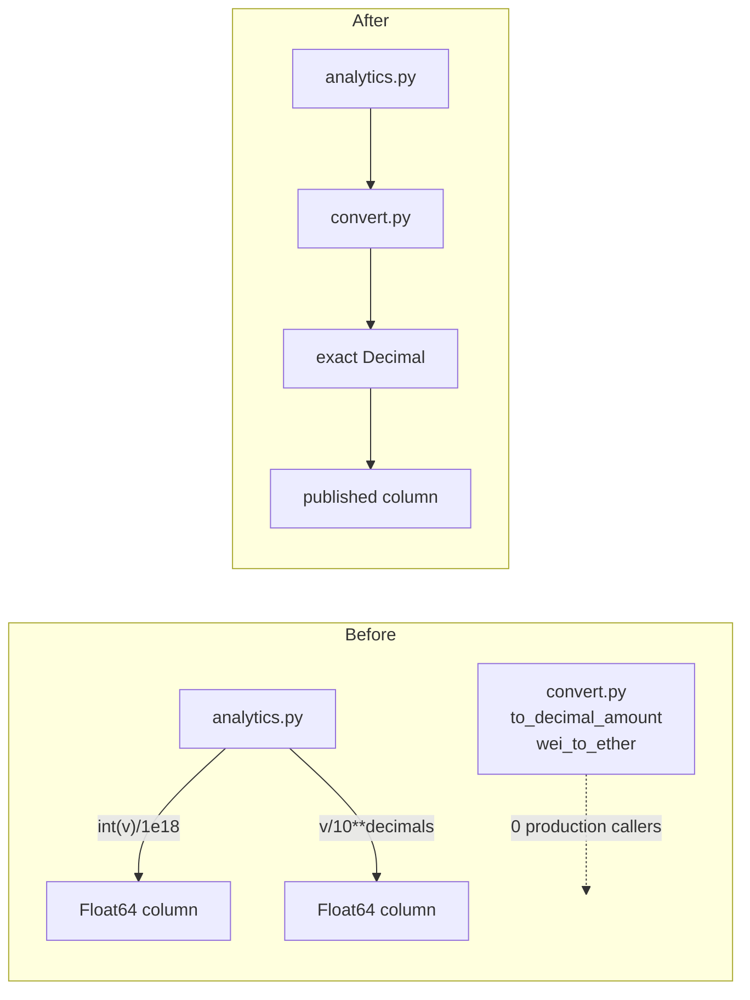

# Architecture review — aiochainscan, 2026-09-05

**Read:** `aiochainscan/core/client.py`, `core/pool.py`, `core/mixins/`, `services/ens_resolver.py`,
`services/analytics.py`, `convert.py`, `domain/`, `adapters/`, `ports/`, `utils/`, and `tests/` —
deliberately the ground the 2026-09-03 pass listed as **not read**, plus the post-refactor state of
the two host classes.

**Not read:** `scanners/` (twelve candidates landed there between 2026-09-03 and 2026-09-04),
`mcp/tools.py` (rewritten by C7), `services/pagination*.py` (merged by C5), `decode.py` /
`abi_pure.py` / `fastabi/`.

**Grounding:** `CONTEXT.md` (Scanner, EndpointSpec, Streaming aggregation, StreamSpec, Provider
field dialect, AddressInfoProvider, ScannerTarget, Port, Adapter), `AGENTS.md` (the Data Integrity
warning table; the hexagonal dependency rule), the 2026-09-03 review (candidates C1–C12, all
`done`). No `docs/adr/` exists yet.

**Numbering:** ids continue from the 2026-09-03 pass (C1–C12) so brief filenames in the shared
`docs/architecture/briefs/` directory do not collide.

## C13 — One declared host contract for the client mixins · Strong

**Status: accepted** — brief [briefs/C13-one-client-host-contract.md](briefs/C13-one-client-host-contract.md).

**Files**
- `aiochainscan/core/mixins/account.py:26-29`, `blocks.py:21-22`, `contracts.py:16-17`,
  `logs.py:21-22`, `proxy.py:10-11`, `stats.py:11-12`, `token.py:19-20`,
  `transactions.py:14-15` — eight private host protocols
- `aiochainscan/core/mixins/chain.py:45-51`, `ens.py:14-16` — two mixins declaring the host with
  bare class annotations instead
- `aiochainscan/core/mixins/ens.py:24-28` — `cast(Any, self)`
- `aiochainscan/services/ens_resolver.py:89-95` — `ENSClient` protocol
- `aiochainscan/domain/contract.py:37` — a ninth `call` re-declaration
- `aiochainscan/core/pool.py:1107-1187` — 81 lines of private-attribute forwarding

**Problem**
Ten domain mixins are shared by two hosts: `ChainscanClient` (`core/client.py:68-79`) and
`ChainscanPool` (`core/pool.py:256-267`). What a host must provide is written down **twelve
times** and never in one place:

- Eight mixins declare a private protocol that re-states the same member —
  `async def call(self, method: Method, **params: Any) -> Any: ...` — once each
  (`account.py:29`, `blocks.py:22`, `contracts.py:17`, `logs.py:22`, `proxy.py:11`,
  `stats.py:12`, `token.py:20`, `transactions.py:15`), plus `contract.py:37` and
  `ens_resolver.py:95`. Only the streaming half of the contract has a single owner
  (`SupportsStreaming`, `core/streaming.py:503`).
- Two mixins declare the host with bare class-level annotations instead:
  `chain.py:46-51` (`_scanner`, `_network`, `scanner_name`, `scanner_version`, `chain_id`,
  `_expected_chain_id`) and `ens.py:15-16` (`_ens_resolver`, `_scanner`).

The two forms are not equivalent, and neither checks what it appears to check. Measured on this
repo's mypy configuration (`pyproject.toml:138-144`, `strict = true`, `files = ["aiochainscan"]`):

- A `self: _SomeProtocol` annotation is checked **at typed call sites only** — a host missing a
  member is reported as `Invalid self argument "Pool" to attribute function "do"` where the method
  is called, not where the class is defined.
- A bare class annotation on the mixin is checked **nowhere**: the annotation is inherited, so a
  host that never assigns the attribute type-checks clean.

Because `files = ["aiochainscan"]` excludes `tests/`, and nothing inside the package calls
`ChainscanPool`'s mixin methods, neither form checks the pool at all. The pool satisfies the
contract only by hand: `pool.py:1107-1187` re-exports `scanner_name`, `scanner_version`,
`chain_id`, `_expected_chain_id`, `currency`, `_scanner`, `_network` and `_ens_resolver` as
properties (most with setters) forwarding to `_active_client`.

That list is maintained by memory, and it is already incomplete. `ENSClient`
(`ens_resolver.py:89-95`) declares `network: str` as required; `ChainscanClient` assigns it
(`client.py:199`); `ChainscanPool` has no such property. The resolver receives `cast(Any, self)`
(`ens.py:25`), which erases the declaration, so `self.client.network` shipped and raised
`AttributeError` for every pool user who hit the unsupported-network path. The fix on
2026-09-04 (`8d4d839`) was `getattr(self.client, 'network', None)` at
`ens_resolver.py:170`, `:217` and `:566` — which satisfies the interpreter by defeating the
protocol the module declares, and now prints `Current network: None` to a pool user.

**Deletion test**
Delete the eight private per-mixin protocols: their complexity does not reappear — they restate
one member of one contract eight times. Pass-throughs. Delete `pool.py:1107-1187` instead and the
complexity *does* reappear, in every mixin that would have to cope with two host shapes — those
forwards earn their keep. They exist only because the contract they satisfy is undeclared.

**Deepening**
One `ClientHost` protocol owning everything a mixin or a domain service needs from its host:
`call`, the identity attributes (`scanner_name`, `scanner_version`, `network`, `chain_id`), the
collaborator attributes the chain and ENS mixins read, and the streaming surface
(`SupportsStreaming` composes in). Every mixin annotates `self: ClientHost`; `ENSResolver` takes
it instead of `Any`; both hosts carry a static conformance assertion so a missing member is a
type error at the host, not an `AttributeError` at a user's call site.

**Interface after** (shape, not final signatures)
- in: one protocol, imported by every mixin and by `ENSResolver`
- invariant: a class listing the mixins as bases satisfies the protocol, asserted statically for
  both `ChainscanClient` and `ChainscanPool`
- errors: a host missing a member fails `mypy --strict` on the package, with no test run needed
- out of the interface: whether the host is a single client or a failover pool

**Verification**
`make validate` (ruff, format, import-lint, `mypy --strict`, full pytest). Add a test that
constructs a `ChainscanPool` and reads every member the protocol declares — including `network`,
which today raises. Assert `mypy --strict` fails when a member is removed from one host: the
guard is vacuous otherwise, since nothing inside the package calls a pool mixin method today.

**Wins**
- locality: the host contract has one home instead of twelve; the pool's forwards become a
  checked list rather than a remembered one
- leverage: a new mixin declares `self: ClientHost` and inherits the whole contract
- test surface: the pool stops being verified by whichever tests happen to touch it

**Risks / out of scope**
`getattr(self.client, 'network', None)` at `ens_resolver.py:170/:217/:566` must be reverted to a
plain attribute read once the pool provides `network` — leaving the `getattr` in place keeps the
defect and hides the new guarantee. Do not change routing, cooldown or sticky behaviour in
`pool.py`. Do not touch `SupportsStreaming`'s member list (C1, 2026-09-03) beyond composing it in.
`_scanner`/`_network` stay private names; this candidate declares them, it does not publish them.

**ADR**
None.

**Before / after**



## C14 — A wiring seam for `ChainscanClient` · Strong

**Status: accepted** — brief [briefs/C14-client-wiring-seam.md](briefs/C14-client-wiring-seam.md).

**Files**
- `aiochainscan/core/client.py:100-249` — the constructor
- `aiochainscan/core/client.py:207-209` (`UrlBuilder`), `:221-233` (`Network`), `:238-246`
  (`Scanner`) — the three collaborators built inside it
- `tests/test_scanner_fetch_page.py:36-56, 99-110`, `tests/test_token_holders.py:51-70, 101-108`,
  `tests/test_iter_transactions_retry.py:34-52, 61-68`,
  `tests/test_blockscout_v2_coverage.py:160-200`, `tests/test_method_consistency.py:651, 803, 856`,
  `tests/test_provider_pool.py:842-846`
- `tests/conftest.py` — four fixtures, none of them a Network double

**Problem**
`ChainscanClient.__init__` fuses two jobs. The first is resolution: turn a `ScannerTarget` (or a
`chain`/`provider` pair) into names, credentials and a chain id — the single resolution point
`CONTEXT.md` describes, and `client.py:160-192` guards it carefully. The second is wiring:
construct a `UrlBuilder` (`:207-209`), a `Network` (`:221-233`) and a `Scanner`
(`:238-246`) and bind them together.

Only the second job's *leaf* dependencies are injectable — `rate_limiter` and `retry_policy`
(`:112-113`) are threaded into a `Network` the client insists on building. The transport and the
scanner themselves cannot be handed in. The class docstring on the pool claims the opposite for
the project as a whole: "DI works exactly like everywhere else in the project"
(`pool.py:274-276`).

The test suite pays for it. There is no supported way to build a client over a stub scanner, so
tests bypass the constructor entirely: `ChainscanClient.__new__(ChainscanClient)` appears 11 times
across 6 files, followed by hand-assignment of the private attributes the skipped constructor
would have set — `client._scanner = ...` at 15 sites. Because `__new__` sets *nothing*, each such
test carries only the attributes its own path happens to read, and a constructor change is felt as
an `AttributeError` in an unrelated test file.

The same gap is why the `Network` double is copied instead of shared: eight test files define
their own `FakeNetwork` (`test_blockscout_v1_ethrpc.py:28`, `test_blockscout_v1_holders.py:22`,
`test_blockscout_v2_coverage.py:160`, `test_etherscan_input_limits.py:29`,
`test_iter_transactions_retry.py:34`, `test_new_spec_endpoints.py:20`,
`test_scanner_fetch_page.py:36`, `test_token_holders.py:51`) despite a `conftest.py` that already
exists and already provides shared fixtures.

**Deletion test**
Nothing is deleted here — the candidate adds a seam rather than collapsing modules, so the
deletion test does not apply cleanly. Recorded anyway: applied to the *tests'* `__new__` +
private-assignment ritual, deleting it concentrates complexity into one construction path, which
is the signal that the ritual is a missing seam rather than a testing convenience.

**Deepening**
Split resolution from wiring behind the class's own interface. `from_config` and the
`chain`/`provider` form keep resolving a `ScannerTarget` and then delegate to one wiring
constructor that accepts already-built collaborators. Tests, the pool and any future embedder use
that seam; nothing reaches past the interface.

**Interface after** (shape, not final signatures)
- in: a `ScannerTarget` plus optional pre-built `Scanner` and `Network`
- out: a fully wired client, every attribute set, no partially-initialised instance reachable
- invariant: `ChainscanClient.__new__` is never a supported construction path
- errors: the existing `TypeError` contract at `client.py:160-192` is unchanged
- follow-on: one shared `Network` double in `tests/conftest.py`, replacing eight copies

**Verification**
`make validate`. Then assert the ritual is gone rather than merely unused:
`rg -c 'ChainscanClient\.__new__' tests/` returns nothing, and
`rg -c '^class FakeNetwork' tests/` returns one file. Both counts are 11-across-6-files and 8
today.

**Wins**
- leverage: one construction path serves production, the pool and every test
- locality: a constructor change lands in one place instead of surfacing as `AttributeError` in
  six test files
- test surface: the client's public interface becomes the test surface; eight `FakeNetwork`
  copies collapse to one

**Risks / out of scope**
`ScannerTarget` resolution is the settled single resolution point (C2, 2026-09-03) — the new seam
consumes it, never re-derives it. Do not widen the public constructor's accepted forms: the
`TypeError` messages at `client.py:160-192` are a deliberate migration contract. Scanner and
Network construction order matters (the scanner receives the client's `Network` for connection
pooling, `client.py:243`) — preserve it. Converting the eight `FakeNetwork` copies is mechanical
but touches eight files; it may be a second commit, not a second candidate.

**Before / after**

```
Before                                   After

ChainscanClient.__init__                 ChainscanClient.from_config
├── resolve ScannerTarget                └── resolve ScannerTarget
├── build UrlBuilder      <- sealed              │
├── build Network         <- sealed              v
└── build Scanner         <- sealed        wiring seam(target, scanner=, network=)
                                                 ├── defaults build the three
tests:                                           └── callers may supply them
  ChainscanClient.__new__(...)  x11
  client._scanner = stub        x15      tests:
  class FakeNetwork             x8         wiring seam(target, scanner=stub, network=fake)
                                           conftest FakeNetwork              x1
```

## C15 — Value conversion with one owner production actually uses · Strong

**Status: done** — brief [briefs/C15-value-conversion-one-owner.md](briefs/C15-value-conversion-one-owner.md); merged to `main` as `6fea223` (2026-09-05).

**Files**
- `aiochainscan/services/analytics.py:125` — `'value_eth': int(value_wei) / 1e18`
- `aiochainscan/services/analytics.py:173` — `'balance': value / (10**decimals) if decimals > 0 else float(value)`
- `aiochainscan/convert.py:76-132` — `to_decimal_amount`, `wei_to_ether`
- `aiochainscan/services/analytics.py:34-43`, `:179-185` — the two Polars schemas
- `tests/test_analytics.py:60, 89, 118` — the float contract, pinned

**Problem**
`convert.py` is the declared owner of exact base-unit math: `to_decimal_amount`
(`convert.py:76-109`) and `wei_to_ether` (`:112-132`) return `Decimal`, and `AGENTS.md` states the
rule in its Data Integrity table — "Balance/value/supply values are **Wei strings** — convert with
`wei_to_ether()` / `to_decimal_amount()` (exact `Decimal`), never `int(wei) / 10**18` float
division."

The DataFrame export path does exactly that division. `analytics.py:125` computes `value_eth` as
`int(value_wei) / 1e18` and `analytics.py:173` computes a token `balance` as
`value / (10**decimals)`. Both land in `Float64` columns (`:40`, `:183`). Float64 carries 53 bits
of mantissa, so every wei amount above 2^53 (≈ 0.009 ETH at 18 decimals) is rounded — silently,
in the column a user reaches for when they want a human-readable number.

Grepped across the package, `to_decimal_amount`, `wei_to_ether` and `format_ether` have **zero**
production callers: `convert.py` is imported by `domain/normalize.py:72` (for `to_datetime`
only), by `scanners/nodereal.py:55` (for `hex_to_int` only) and by `__init__.py:3` (re-export).
The module is deep and correct; the one path in the package that needs it re-derived the rule
instead, and got it wrong.

A second, smaller split of the same fact: hex-or-decimal integer parsing exists twice, as
`convert.py:_parse_flexible_int:58-73` (raises on bad input) and
`domain/normalize.py:int_or_default:164-179` (returns a caller default). The error contracts
genuinely differ, but the parse rule — `0x` prefix detection, sign handling — is copied.

**Deletion test**
Negative, and the candidate is recommended anyway. Deleting `convert.py`'s value helpers removes
nothing from production today, because nothing calls them; deleting the inline math in
`analytics.py` moves complexity to a single caller rather than concentrating it across N. The
finding is a **locality** failure, not a shallow module: one rule with two owners, where the
owner that ships is the wrong one, and a project rule written into `AGENTS.md` is violated in the
only place it applies.

**Deepening**
`analytics.py` reads its scaled values from `convert.py` and stops doing base-unit arithmetic.
The open design question — which the brief must settle before any code moves — is what the public
column becomes: keep `Float64` and derive it from the exact `Decimal` (documented precision
ceiling), switch to `pl.Decimal`, or add an exact string column beside the float. Fold the
`int_or_default` parse rule onto `_parse_flexible_int` in the same pass, keeping both error
contracts.

**Interface after** (shape, not final signatures)
- in: a raw provider value plus its decimals
- out: an exact `Decimal`, and whatever column type the brief settles on
- invariant: no base-unit division outside `convert.py`
- errors: unchanged from `convert.py`'s current contract

**Verification**
`uv run pytest tests/test_analytics.py tests/test_convert.py -q`, then `make validate`. Add a case
whose wei value is not representable in Float64 (e.g. `1234567890123456789`) and assert the exact
result — the current suite's largest case is `1_000_000` ETH at `rel=1e-10`
(`tests/test_analytics.py:118`), which float handles, so the existing tests cannot fail on this
defect.

**Wins**
- locality: base-unit math has one owner; the `AGENTS.md` rule becomes checkable by grep
- leverage: `convert.py` starts paying back inside the package, not only for library users
- test surface: precision is asserted once against `convert.py`, not per DataFrame column

**Risks / out of scope**
`value_eth: pl.Float64` (`analytics.py:40`) and `balance: pl.Float64` (`:183`) are the published
1.0.0 DataFrame schema, and `tests/test_analytics.py:60, 89, 118` pin float semantics with
`pytest.approx`. Changing a column's dtype is a breaking change and needs the user's decision
before the brief is written — deriving the float from an exact `Decimal` is the non-breaking half
and may be all this candidate ships. Do not touch `transactions_to_dataframe_arrow`
(`analytics.py:189-229`): its values come from the Rust tier, not from this arithmetic. Do not
change `hex_to_int`'s public behaviour.

**Decision (2026-09-05)**
Non-breaking: `value_eth` and `balance` stay `pl.Float64`; the float is produced by narrowing an
exact `Decimal` exactly once instead of dividing twice. Adding exact columns beside the floats and
changing the dtypes were both considered and declined.

**ADR**
None. The `Float64` choice above is now deliberate and recorded here; if it is ever re-questioned,
promote this line to an ADR rather than re-deriving it.

**Before / after**



## C16 — Put the progress-port adapters where the port's adapters live · Speculative

**Status: done** — merged as `182d765`. Brief [briefs/C16-progress-adapters-at-the-port.md](briefs/C16-progress-adapters-at-the-port.md).

**Files**
- `aiochainscan/ports/progress.py:8-65` — the `ProgressCallback` port
- `aiochainscan/utils/progress_helpers.py` (whole file, 336 lines) — six factories satisfying it
- `aiochainscan/adapters/__init__.py:1-11` — three exported adapters, none of them for progress
- `.importlinter:1-38` — the import-linter contracts that actually run: three of them, sourced on
  `domain`, `ports` and `services`. None is sourced on `adapters`.
- `pyproject.toml:147-212` — a `[tool.importlinter]` section with six contracts that **never
  execute**: import-linter reads `setup.cfg`, then `.importlinter`, then `pyproject.toml`, and stops
  at the first file carrying a config section. See C17.

**Problem**
`CONTEXT.md` defines **Adapter** as "concrete implementation of a port in
`aiochainscan/adapters/`". `ports/progress.py` declares `ProgressCallback`; its six concrete
satisfiers — `console_progress`, `tqdm_progress`, `rich_progress`, `silent_progress`,
`logging_progress`, `callback_with_interval` — live in `utils/progress_helpers.py` instead. A
reader who follows the project's own definition to `adapters/` finds `AioLimiterAdapter`,
`SimpleRateLimiter` and `TenacityRetryAdapter` and concludes the port has no adapters.

The consequence is structural, not behavioural, and it is smaller than it first looks. `utils/` is
named by no import-linter contract — but neither is `adapters/`: the "Adapters do not import
services / domain" rule lives in the dead `pyproject.toml` section (C17), so no adapter is guarded
by it either. What the move buys is therefore navigational only: the six factories sit where
`CONTEXT.md` says a port's adapters sit, and they land inside the package that a corrected
contract would name. `progress_helpers.py` reaches `tqdm` and `rich` lazily, so nothing is broken
today.

**Deletion test**
Positive but weak. Delete `progress_helpers.py` and the complexity reappears in every caller that
wants a progress display — it is a real adapter set earning its keep. What is wrong is only where
it sits, which is why this is speculative: the win is navigational, and the move costs a public
import path.

**Deepening**
Move the six factories to `adapters/progress.py`, keep `utils/progress_helpers` as a re-export for
the documented import path (`AGENTS.md` shows
`from aiochainscan.utils.progress_helpers import console_progress`). Extending the contracts to
cover the new module turned out to be C17's job, not this one's — there is no live adapters
contract to extend.

**Interface after** (shape, not final signatures)
- in: unchanged factory signatures
- out: unchanged callbacks
- invariant: every satisfier of a port in `ports/` lives under `adapters/`
- compatibility: the documented `utils.progress_helpers` path keeps working

**Verification**
`uv run lint-imports` (also run by `make validate`) with the extended contract. There is no test
file for these six factories — `tests/` holds no `test_progress_helpers.py` — so the move is
otherwise unverified, and writing one that imports through both paths is part of the candidate.

**Wins**
- locality: a port's adapters are found where the glossary says they are
- leverage: six more modules land inside the package a corrected adapters contract would name (C17)

**Risks / out of scope**
The re-export must stay: `AGENTS.md` documents the `utils.progress_helpers` path and this is a
1.0.0 library. Do not move `utils/date.py` in the same pass — `default_range` has no production
caller (`utils/date.py:10`), which is a separate question about public API, not about seam
location. Do not add an adapter for a port that has none.

**ADR**
None.

**Before / after**

```
Before                                  After

ports/progress.py  (port)               ports/progress.py  (port)
adapters/                               adapters/
  aiolimiter_adapter.py                   aiolimiter_adapter.py
  simple_rate_limiter.py                  simple_rate_limiter.py
  tenacity_retry.py                       tenacity_retry.py
utils/                                    progress.py        <- 6 factories
  progress_helpers.py  <- 6 factories   utils/
                                          progress_helpers.py  <- re-export
```

## C17 — Import contracts that actually run · Strong

**Status: open** — found while implementing C16; no brief yet.

**Files**
- `.importlinter:1-38` — the live config: `root_package = aiochainscan` and three contracts.
- `pyproject.toml:147-212` — `[tool.importlinter]` with six contracts that never execute.
- `aiochainscan/services/pagination.py:75-76` — the imports that break one of them.

**Problem**
The repo carries two import-linter configurations and runs only one of them. import-linter looks for
`setup.cfg`, then `.importlinter`, then `pyproject.toml`, and stops at the first file that has a
config section. `.importlinter` exists (added by `2efaa17`), so the six contracts in
`pyproject.toml` — the ones a reader finds first, because `pyproject.toml` is where every other tool
in this repo is configured — have never been evaluated.

The live set and the dead set are not the same rules. Live: "Domain must be isolated", "Ports must
not depend on upper layers", "Services should not depend on adapters (initial)". Dead but stricter
in two places: **"Adapters do not import services"/"...domain"** and **"Services do not import core
or network"**. So the layering rule `AGENTS.md` states in its architecture diagram ("Only downward.
Never upward.") is enforced for `domain`, `ports` and half of `services`, and enforced nowhere for
`adapters`.

**This is not merely dead config — it is hiding a live violation.** Measured: move `.importlinter`
aside, run `uv run lint-imports`, and the pyproject set reports `5 kept, 1 broken` —
"Services do not import core or network", broken by `aiochainscan/services/pagination.py:75`
(`from ..core.endpoint import coerce_response_items`) and `:76` (`from ..core.types import
JSONDict`). Restoring `.importlinter` returns `3 kept, 0 broken`. Every green `make validate` in
this repo's history has been green partly because the stricter file was not the one being read.

**Deletion test**
Delete `pyproject.toml:147-212` and nothing changes at all — which is the finding. The section is a
pure pass-through to nowhere: it looks like a contract, is cited as a contract (this review cited it
twice before the C16 lane caught it), and constrains nothing.

**Deepening**
One config file, and its contracts true. Concretely, in order:

1. Decide which of the two sets is the intended architecture. The dead set is stricter and matches
   `AGENTS.md`; the live set is what the code currently satisfies.
2. Delete the losing file/section outright — not comment it out. Two configs is the defect.
3. For each rule the surviving set adds, either fix the code or record the exception explicitly.
   `services/pagination.py:75-76` is the only known one: `coerce_response_items` and `JSONDict` are
   `core` names a service reaches upward for, and moving them (to `domain/` or to a shared types
   module below both) is the repair. Do not weaken the contract to absorb it.

**Interface after** (shape, not final signatures)
- in: one config file, at one path
- invariant: the contracts named in `AGENTS.md`'s dependency rule are the contracts `make validate`
  runs, and `lint-imports` prints their names
- non-vacuity: for each surviving contract, injecting the forbidden import makes it fail —
  demonstrated per contract, not assumed

**Verification**
`uv run lint-imports` must print the intended contract names — the names are the observable, since a
silently-shadowed file also exits 0. Then prove each contract can fail: add the forbidden import,
show the break, remove it. The C16 lane already ran this probe for the adapters rule and showed
`3 kept, 0 broken` with a `services` import injected into `adapters/progress.py`.

**Wins**
- locality: one place declares the layering, and it is the place `AGENTS.md` describes
- leverage: `adapters/` gets a dependency rule for the first time — six modules from C16 included
- the class of bug this closes is the worst kind: a guard that reports green forever

**Risks / out of scope**
Activating the stricter set breaks `make validate` until `services/pagination.py` is repaired, so
config and code must land together. Whether `coerce_response_items` / `JSONDict` belong in `core`,
`domain` or a new shared module is a real design question this candidate opens and does not settle.
Do not fix it by adding `services.pagination` to an ignore list — that reproduces the defect in a
new form. Widening `mypy`'s `files` (`pyproject.toml:144`) is unrelated and stays out.

**ADR**
Worth one once the intended set is chosen: "the layering contracts live in <file>, and here is why
`services -> core` is (or is not) allowed." A future pass will otherwise re-derive this.

**Before / after**

```
Before                                  After

.importlinter        <- runs           .importlinter        <- runs
  3 contracts                            6 contracts, all true
pyproject.toml                         pyproject.toml
  [tool.importlinter]  <- never read     (section deleted)
  6 contracts, 1 already broken

services/pagination.py -> core.*       services/pagination.py
  (unguarded)                            (repaired, or the rule says why not)
```

## Pass-3 notes — friction seen and deliberately not pursued

Recorded so a future pass does not re-derive them, and so the bar that kept them out is visible:

- `aiochainscan/adapters/simple_rate_limiter.py:9` — exported (`adapters/__init__.py:4`) but never
  constructed in production; `network.py:295` always builds `AioLimiterAdapter`. It is still the
  second adapter that makes the `RateLimiter` seam real rather than hypothetical, and a 1.0.0
  library may ship an injectable it does not itself use. Leave.
- `aiochainscan/utils/date.py:10` (`default_range`) — zero callers in `aiochainscan/`, exercised
  only by `tests/test_utils_date.py`. Public-API question, not an architecture one; decide with a
  deprecation, not a refactor.
- `aiochainscan/services/analytics.py:160-170` — `token_portfolio_to_dataframe` reads literal
  provider keys (`'token'`, `'decimals'`, `'symbol'`, `'name'`) while its sibling
  `transactions_to_dataframe` goes through the `domain/normalize.py` accessors. Only
  `contract_address` uses `first_field` (`:165`). Small, and it belongs to whichever brief touches
  this function next — C15 is the likely one.
- `aiochainscan/exceptions.py:78` — `MethodNotDeclaredError` declares `failure_kind` at class level
  but does not subclass `ChainscanClientError`, so it has no `__init__` supporting a per-instance
  override like its `ChainscanClientError` siblings. Deliberate (it must stay a `ValueError`);
  noted only so it is not read as an oversight.
- The 2026-09-03 pass-2 notes still stand unchanged: `pool.py:138-144` unreachable branches,
  `exceptions.py:291-292/:364-365` inline overrides, `network.py:31-48` re-export block,
  `config.py:289-323` domain table, `tests/test_mcp_server.py:1089-1098` one-directional invariant.

## Top recommendation

**C13.** It is the only candidate with a defect that has already shipped and is still live — a
pool user reaching the ENS unsupported-network path is told `Current network: None`
(`ens_resolver.py:170`), because the workaround merged on 2026-09-04 defeats the protocol at
`ens_resolver.py:89-95` rather than satisfying it. The deletion test comes back clean on the eight
duplicate protocols, the consolidation target already exists in the same shape
(`SupportsStreaming`, `core/streaming.py:503`), and the change is confined to `core/`.

C14 is the natural second: it removes the reason tests reach past the interface, and C13's new
guard is easier to write once a client can be constructed over a stub. C15 needs one decision from
the user (breaking dtype or not) before its brief can be written. C16 is cheap and can wait.
