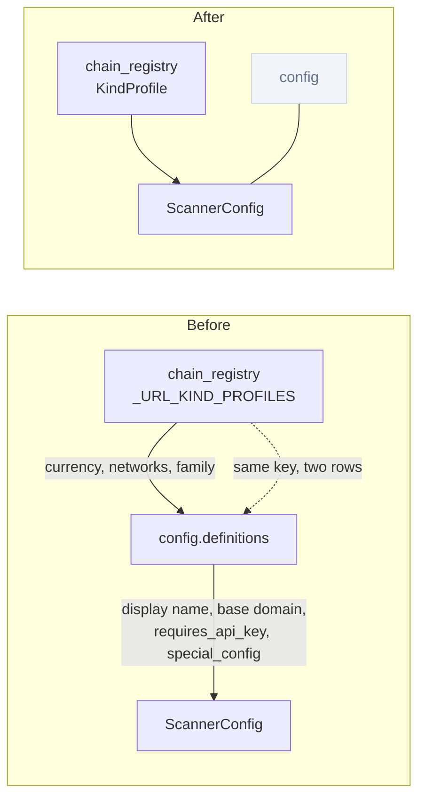
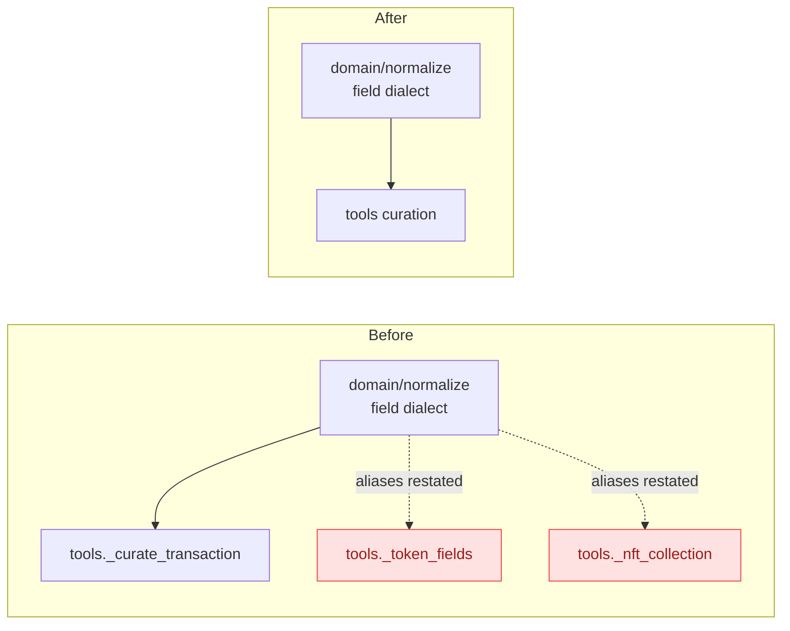
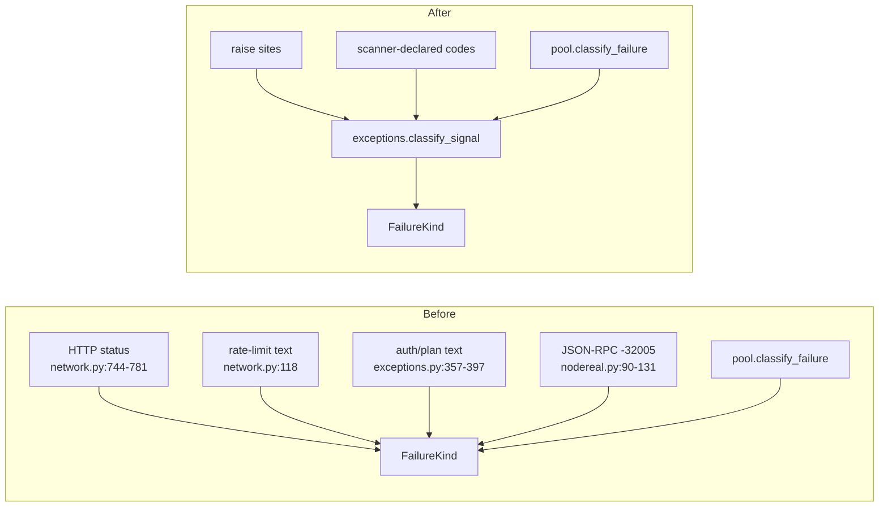

# Architecture review — aiochainscan, 2026-09-08

**Read:** `config.py`, `chain_registry.py`, `network.py`, `exceptions.py`,
`scanners/nodereal.py`, `scanners/base.py`, `scanners/_etherscan_like.py`, `mcp/`,
`decode.py`, `abi_pure.py`, `fastabi/src/lib.rs`, and the matching tests — the modules that
absorbed the 2026-09-05 bug-hunt fix wave (`e07c74e`..`5a2f6f8`). Defect density is the
selection signal: seven consecutive fix commits landed here.

**Not read:** `core/client.py`, `core/pool.py`, `core/mixins/`, `core/streaming.py`,
`services/pagination.py` (C1/C5/C13/C14 landed there and the 2026-09-05 pass covered them),
`domain/contract.py`, `adapters/`, `ports/`.

**Grounding:** `CONTEXT.md` (Scanner, EndpointSpec, Provider field dialect, ScannerTarget,
Port, Adapter, KECCAK_BACKEND), `AGENTS.md` (the decode-tier output convention; the
hexagonal dependency rule), `docs/adr/0001-layering-contracts-live-in-pyproject.md`, and the
two prior passes (C1–C17, all `done`).

**Numbering:** ids continue from C17 so brief filenames in `docs/architecture/briefs/` do not
collide.

**Residual candidates:** C20 and part of C19 are residue of finished work (C9 gave the
Provider field dialect one owner; C6 gave decode one seam). They are named as residue, not as
a re-suggestion — each says what the earlier candidate left behind and why.

## C18 — One row per scanner id · Strong

**Files**
- `aiochainscan/config.py:383-445` (the `definition()` helper and the twelve builtin rows)
- `aiochainscan/chain_registry.py:98-184` (`_URL_KIND_PROFILES`, keyed by the same ids)
- `aiochainscan/chain_registry.py:405-455` (`SCANNER_CONFIG_NETWORKS`,
  `URL_BUILDER_CURRENCIES`, `CONFIG_CREDENTIAL_FAMILY` — derived views config imports)

**Problem**
One scanner id is described by two tables that must be edited together. `chain_registry.py`
owns currency, config networks and credential family (`_URL_KIND_PROFILES:100-129`), and
`config.py:392-397` correctly imports the derived views rather than restating them. But
display name, base domain, `requires_api_key` and `special_config` live only in
`config.py:400-433` — a second row per id, in a different module, with no declaration linking
the two. `'fantom'` carries `base_url='https://ftmscan.com'` at
`chain_registry.py:131-135` **and** `base_domain='ftmscan.com'` at `config.py:406`; the same
split repeats for gnosis, flare, linea and blast. Adding a chain means editing two files in
two shapes, and nothing fails if only one is edited: the registry row alone yields a chain
with no config entry, the config row alone raises `KeyError` in `definition()` — a construction
error, not a declaration error.

**Deletion test**
Delete the `definitions` dict at `config.py:400-433`: its complexity does not vanish, it
reappears at exactly one caller — `_init_builtin_scanners`. That is the signal to move it,
not to keep it: the rows are data, and their only consumer is a builder that already reads
three other views of the same key from the registry.

**Deepening**
Extend `KindProfile` (`chain_registry.py:60-98`) with the four fields config still owns, and
let `config.py` build every `ScannerConfig` from the profile. `chain_registry.py` becomes the
single module that answers "what scanner ids exist and what is true of each"; `config.py`
keeps only credential resolution, which is what `CONTEXT.md` already claims it does.

**Interface after** (shape, not final signatures)
- in: a scanner id
- out: one frozen record carrying currency, networks, credential family, display name, base
  domain, key requirement and special config
- invariant: a scanner id that exists in the registry constructs a `ScannerConfig`; one that
  does not is absent from both, never half-present
- errors: an incomplete row fails at import, not on first `get_scanner_config()`

**Verification**
`uv run pytest tests/test_config.py tests/test_registry_consistency.py tests/test_custom_base_url.py -q`
stays green. Add a test asserting the id sets of the registry and of
`ConfigurationManager`'s builtins are equal — today nothing asserts that.

**Wins**
- locality: a new chain is one row in one module
- leverage: `config.py` stops carrying topology it does not use
- test surface: the id-set equality becomes assertable instead of implicit

**Risks / out of scope**
`ScannerConfig` is public-ish (`get_scanner_config()` returns a deep copy,
`config.py:653`) — its shape must not change, only where its fields come from. Do not touch
credential resolution (`config.py:576-708`) or the `.env` loading order; those are C22.

**ADR**
None. `docs/adr/0001` covers import layering only, and this change moves data toward the
lower layer, not across it.

**Before / after**



## C19 — One declared decoded-value convention · Worth exploring

**Files**
- `aiochainscan/decode.py:346-373` (`_to_rust_convention`, value-directed)
- `aiochainscan/abi_pure.py:446-472` (`to_json_values` / `_to_json`, type-directed)
- `aiochainscan/fastabi/src/lib.rs:857-947` (`unsigned_to_json`, `signed_to_json`,
  `convert_token_to_json`)
- `aiochainscan/decode.py:322-343` and `fastabi/src/lib.rs:119-136` (param-name resolution,
  written twice with the same docstring)

**Problem**
The output convention `AGENTS.md` states once — ints outside i64 as strings, `bytes` as `0x`
hex, arrays and tuples as `list`, fixed-point as a plain fixed-point string — has three
implementations, and they are not interchangeable. `abi_pure._to_json:469-470` renders a
fully-named tuple as a **dict**, while `decode.py:371-372` renders every tuple as a **list**;
both are reachable from public entry points (`decode_arguments` feeds MCP `read_contract` at
`mcp/tools.py:1109`, `_to_rust_convention` feeds `decode_transaction_input` at
`decode.py:542` and log decoding at `decode.py:795`). The i64 threshold literal
`9223372036854775807` appears at `decode.py:362` and `lib.rs:859`. Param naming
(`param_{i}`, `_2` suffix on collision) is implemented at `decode.py:322-343` and again at
`lib.rs:119-136`.

C6 gave decoding one *seam*; the convention behind that seam is still restated per
implementation.

**Deletion test**
Negative, and worth doing anyway. The Rust implementation cannot be deleted — it is a
separate language and must restate the rule. What can be deleted is the *silence* about
whether the three agree: nothing today declares the convention as data, so a divergence
(the tuple case) survives in the repo while `AGENTS.md` describes uniformity.

**Deepening**
Declare the convention once as a table (rule name → input shape → output shape) and drive a
parity test from it across all three implementations, rather than from hand-written examples
per tier. Decide the tuple rule explicitly — either `decode_arguments` keeps its dict shape
and the rule reads "named tuples are dicts on the argument-decoding path", or it aligns with
the list rule — and write that decision down. Fold the two param-name implementations into one
declared rule the Rust side is tested against, not one it re-derives.

**Interface after** (shape, not final signatures)
- in: a decoded native value plus its type node
- out: the JSON-convention value
- invariant: every rule holds for both tiers and for both entry points; the tuple rule is
  stated, not inferred
- errors: unchanged (`AbiTypeNotSupportedError` at index build)

**Verification**
`uv run pytest tests/test_abi_pure.py tests/test_decode.py -q` green with and without the
Rust extension built (`cd aiochainscan/fastabi && uv run --with maturin maturin develop
--release`). The parity test must fail if any single rule is changed in one implementation
only — prove that by changing one and observing the failure before reverting.

**Wins**
- locality: a convention change lands in one table plus three implementations that a test
  holds together
- leverage: the tuple divergence becomes a stated decision instead of a discovery
- test surface: 6 tests currently skip when the Rust extension is absent
  (`tests/test_abi_pure.py:207,225,287,309,341`, `tests/test_crypto.py:251`) — the table makes
  the pure side of parity assertable unconditionally

**Risks / out of scope**
Changing the shape `decode_arguments` returns is a **visible break** for MCP `read_contract`
(`tests/test_mcp_server.py:447` pins the dict shape). If the decision is "keep the dict",
this candidate is documentation plus a test, not a behaviour change — say so before starting.
Do not touch the strict-padding validation in `lib.rs:validate_sequence` or the tier-fallback
rules; those are correctness surfaces with measured costs recorded in `AGENTS.md`.

**ADR**
Worth one if the tuple rule is decided as "two conventions, deliberately" — a future pass
will otherwise re-file it as a divergence.

**Before / after**

```
Before                              After
------                              -----
AGENTS.md prose ....... (no test)   convention table ......... one declaration
decode.py  _to_rust_convention        |-- decode.py impl ...... asserted
abi_pure.py _to_json  (differs!)      |-- abi_pure.py impl .... asserted
lib.rs     convert_token_to_json      `-- lib.rs impl ......... asserted
decode.py  _resolved_input_names    param naming ............. one declaration
lib.rs     resolved_param_names       `-- both impls .......... asserted
```

## C20 — MCP curation reads through the Provider field dialect · Worth exploring

**Files**
- `aiochainscan/mcp/tools.py:250-292` (`_token_fields`, `_nft_collection`)
- `aiochainscan/domain/normalize.py:301-329` (`normalize_token_transfer`, the same aliases)
- `aiochainscan/mcp/tools.py:48-51, 239-240` (the keys tools.py *does* import from the dialect)

**Problem**
`CONTEXT.md` names `domain/normalize.py` the owner of the **Provider field dialect** — the
alias vocabulary that reads Etherscan camelCase and BlockScout V2 nested shapes — and C9
landed that ownership. `mcp/tools.py:239-240` honours it for transactions. The token and NFT
curators do not: `_token_fields:253-265` re-derives `contractAddress` / `address_hash` /
`address`, `tokenSymbol` / nested `symbol`, `tokenName` / nested `name`, `tokenDecimals` /
nested `decimals` and a three-way balance fallback by hand, and
`_nft_collection:280-288` does the same for the collection shape. `normalize_token_transfer`
at `domain/normalize.py:306-325` already encodes the same alias orders. Two readers, one
dialect, and the emptiness rule (`0` survives, `''` does not) is enforced by
`first_field` in one of them and by `or` chains in the other — `_token_fields:265` chains
`or` over `balance` / `tokenBalance` / `value`, so a provider answering an integer `0`
(BlockScout V2 returns JSON numbers for some fields) falls through to the next alias and then
to the `'0'` literal. `first_field` exists precisely to keep `0` a value.

**Deletion test**
Delete `_token_fields` and `_nft_collection`: their alias knowledge reappears at exactly one
caller each, but it is knowledge that already has a home. The curation *shape* (which fields
the MCP envelope exposes) earns its keep; the alias resolution inside it does not.

**Deepening**
Move the alias orders into `domain/normalize.py` as dialect accessors and let the MCP
curators call them, keeping only the envelope-shaping in `mcp/tools.py`.

**Interface after** (shape, not final signatures)
- in: a provider-native token-holding or NFT item
- out: the dialect-resolved fields (contract, symbol, name, decimals, raw balance)
- invariant: `0` and `'0'` are values, not absence — the rule `first_field` already holds
- errors: unchanged; a missing field stays `None`

**Verification**
`uv run --extra mcp pytest tests/test_mcp_server.py tests/test_normalize.py -q` green, plus a
test asserting an integer `0` balance is curated as `0`, not resolved from a later alias. `get_contract_abi`
(`mcp/tools.py:942`) has no direct test today — it is exercised only through `read_contract`;
add one in the same pass.

**Wins**
- locality: an alias added for a new provider reaches MCP without a second edit
- leverage: the emptiness rule is enforced once instead of twice, differently
- test surface: one untested tool gains a test

**Risks / out of scope**
Do not change the curated field *names* in the MCP envelope — agents depend on them. Leave
`clamp_page_size`, cursor handling and `format_units` alone; C7 already gave those one owner.

**ADR**
None.

**Before / after**



## C21 — One owner for FailureKind · Worth exploring

**Files**
- `aiochainscan/network.py:744-781` (HTTP 429 / 401 / 403 / 5xx → exception + kind, inline)
- `aiochainscan/exceptions.py:357-397` (`_AUTH_PATTERNS`, `_PLAN_PATTERNS`,
  `api_error_failure_kind`)
- `aiochainscan/network.py:118` (`_RATE_LIMIT_MARKERS`, the Etherscan-text rate-limit rule)
- `aiochainscan/scanners/nodereal.py:90-152` (`-32005` split into rate limit vs result-window
  refusal)
- `aiochainscan/core/pool.py:108-158` (`classify_failure`, the kind-less fallback ladder)

**Problem**
The design is already sound in one respect — `classify_failure:139-141` takes a carried
`failure_kind` first, so a new scanner wires its failure modes by raising a kind-carrying
exception. What is spread is the *deciding*: text patterns live in `exceptions.py:357-370`,
the rate-limit text rule lives separately at `network.py:118`, HTTP status → kind is written
inline in the raise site at `network.py:755-778`, and the JSON-RPC code rules live in
`nodereal.py:90-131`. Four vocabularies, no module you can read to learn what makes a failure
`AUTH` or `TRANSIENT`. `_RATE_LIMIT_MARKERS` and `_AUTH_PATTERNS` are the same kind of rule
(match provider text, return a kind) in two modules.

**Deletion test**
Negative for the exception classes and for `classify_failure` — both earn their keep. Positive
for the *placement*: moving the HTTP-status and rate-limit-text rules next to
`api_error_failure_kind` removes no complexity, it concentrates it, which is the locality
argument rather than the deletion argument. Recommended on that basis, at
`worth-exploring` strength only.

**Deepening**
One classification module in `exceptions.py` owning every provider-signal → `FailureKind`
rule (HTTP status, Etherscan text, JSON-RPC code), with `network.py` and the scanners calling
it at their raise sites. Provider-specific codes stay declared by the scanner but resolve
through the same function.

**Interface after** (shape, not final signatures)
- in: a provider signal (HTTP status, envelope message/result, JSON-RPC code + message)
- out: a `FailureKind`
- invariant: the raise site and the pool fallback cannot disagree — they already call one
  helper for text; this extends that property to statuses and codes
- errors: none; classification returns `FATAL` when nothing matches

**Verification**
`uv run pytest tests/test_network.py tests/test_provider_pool.py tests/test_nodereal.py -q`
green. Add a table-driven test enumerating every signal → kind pair; today each rule is
tested where it is written, so no test states the whole mapping.

**Wins**
- locality: one module answers "why did the pool fail over"
- leverage: a new provider declares codes, not a classification ladder
- test surface: the mapping becomes one table instead of assertions in three test files

**Risks / out of scope**
`FailureKind` steers pool cooldowns (`core/pool.py`) — a reclassification changes operational
behaviour. This is a move, not a re-decision: every existing signal must map to the kind it
maps to today, asserted before and after. Do not touch the retry vocabulary
(`exceptions.TRANSIENT_EXCEPTIONS`) or the NodeReal envelope's placement inside
`Network._send` — that placement is what puts the usage-limit meaning under the retry policy.

**ADR**
None.

**Before / after**



## C22 — A ConfigurationManager that tests can construct · Speculative

**Files**
- `aiochainscan/config.py:270-348` (`_ensure_initialized`, `_ensure_env_loaded`,
  `_get_scanner_config_lazy`)
- `tests/test_config.py` — 18 `reset_instance()` calls (331, 435, 449, 472, 479, 489, 499,
  503, 509, 513, 632, 649, 667, 835, 850, 858, 869, 883, 898)
- `tests/test_config.py:656-667` (`isolated_manager` fixture), `tests/test_config.py:250,
  425, 439, 615, 639, 645` (direct `manager._scanners[...]` mutation)
- `tests/test_registry_consistency.py:70-79`, `tests/test_custom_base_url.py:50-57` (the same
  reset ritual, in two more test modules)

**Problem**
`ConfigurationManager` is a process-wide singleton, so a test that constructs one changes the
next test's world. Every test module that touches configuration pays for it: singleton reset
before and after, `Path.home` monkeypatched, `os.environ` cleared, and — because
`get_scanner_config()` returns a deep copy (`config.py:653`) — mutation of the private
`_scanners` dict to set up a case. Three test modules reproduce the same ritual. The
**interface** of the module includes "you are sharing this with everyone", and the tests are
the evidence.

Initialization order is part of the interface too and is documented only in comments:
`_load_api_keys` must run after `_load_config_files` (`config.py:294-295`) and
`_ensure_env_loaded` exists because the "`.env` loads on first access" contract otherwise
depends on which caller arrives first (`config.py:297-310`).

**Deletion test**
Negative on the module, positive on the singleton. Deleting the *sharing* moves no complexity
to callers — production has one instance because the process wires one, not because the class
enforces it.

**Deepening**
Make the singleton a module-level default instance rather than a class invariant: construction
is free and hermetic, `get_instance()` keeps returning the shared one. Tests construct their
own and delete the reset ritual. Fold the ordering rules into one documented sequence rather
than comments at three call sites.

**Interface after** (shape, not final signatures)
- in: an optional config dir
- out: an independent manager
- invariant: constructing one has no effect on any other; the shared instance is opt-in
- errors: the `config_dir` mismatch warning (`config.py`) disappears — it exists only because
  construction is shared

**Verification**
`uv run pytest tests/test_config.py tests/test_registry_consistency.py
tests/test_custom_base_url.py -q` green after deleting the reset calls. The count of
`reset_instance()` occurrences under `tests/` is the metric: 18 → 0 in `test_config.py`.

**Wins**
- locality: config test setup stops leaking across modules
- leverage: a hermetic manager is constructible by any future test
- test surface: three fixtures collapse; `patch.dict(os.environ, clear=True)` stops being
  load-bearing

**Risks / out of scope**
`reset_instance()` and `reload()` are public and used outside tests — check before removing
either. Changing when `.env` is read is a **behaviour** change for users who mutate
`os.environ` after import; the deepening must keep the current read order and only stop
sharing it. Do not merge this with C18 — the two touch the same file for opposite reasons.

**ADR**
Offer one if the singleton is kept deliberately: the reason would otherwise be re-suggested.

**Before / after**

```
Before                                  After
------                                  -----
class-level singleton                   module-level default instance
  test: reset_instance()                  test: ConfigurationManager(tmp)
  test: monkeypatch Path.home             test: (still, for ~/.aiochainscan)
  test: patch.dict(environ, clear=True)   test: (only where env is the subject)
  test: mutate manager._scanners[...]     test: construct with the case
  x3 test modules                         x0
```

## Top recommendation

C18. It is the only candidate whose deletion test comes back clean, it removes an edit-two-
files-or-it-half-works trap on the path every new chain takes, and the change is contained in
two modules with existing test coverage. C20 is the cheapest second — it is finishing C9
rather than starting something.
