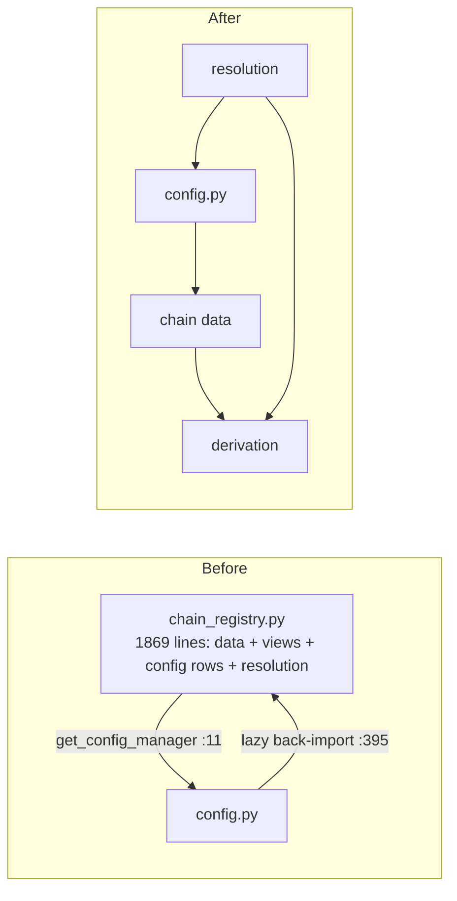
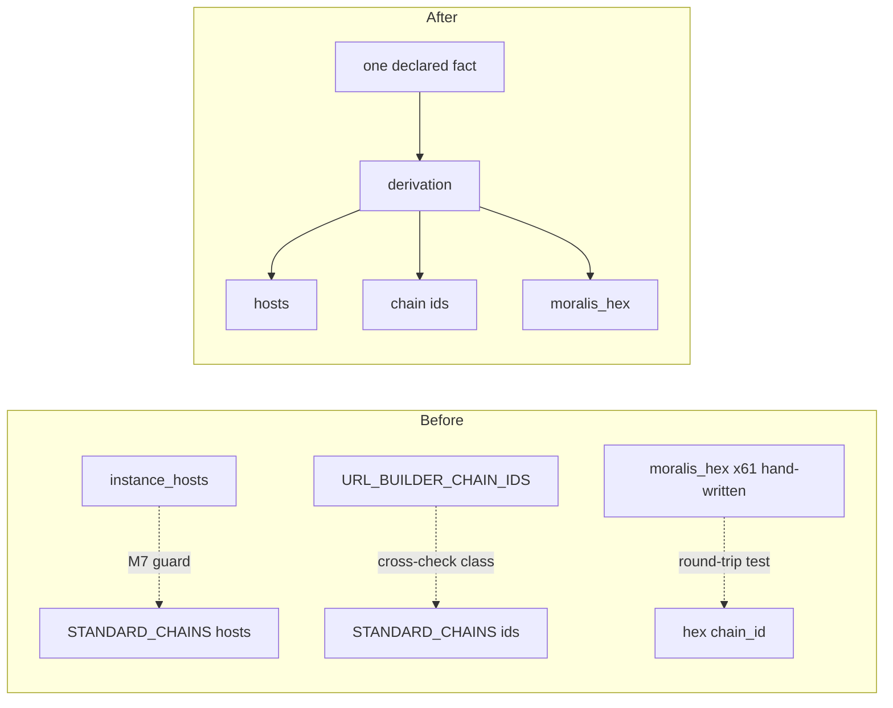
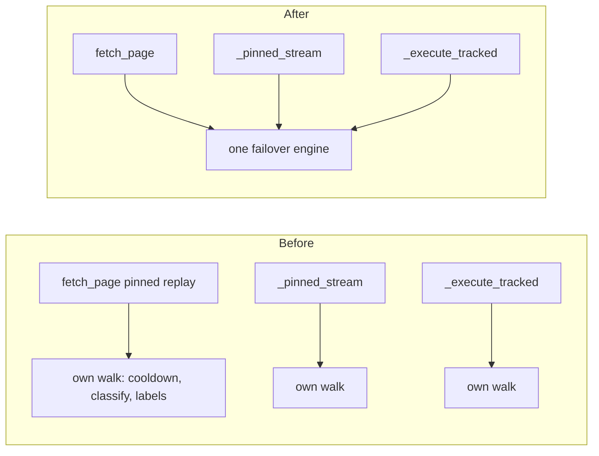

# Architecture review — aiochainscan, 2026-09-13

**Read:** the post-review churn — `chain_registry.py` (+743 lines since the 2026-09-08 pass,
10 touches in the last 60 commits), `registry_sync.py` (new), `config.py`, `cli.py` (598
lines reworked), `core/pool.py` (the 1.0.5 cursor-pinning fix `b7df349`), `services/pagination.py`,
`services/ens_resolver.py`, `core/mixins/`, `core/streaming.py`, `network.py`.
**Not read:** `fastabi/`, `decode.py`, `abi_pure.py` (covered by the C6/C19 passes; deltas are
small), `mcp/` (C7/C20 passes; 62 lines changed), `adapters/`.
**Grounding:** `CONTEXT.md` (Scanner, EndpointSpec, Page cursor, Pagination engine, StreamSpec,
ScannerTarget), `docs/adr/0001` (layering contracts in `pyproject.toml`), `docs/adr/0002`
(ConfigurationManager stays a singleton). All 22 candidates from the 2026-09-03/05/08 passes
are `done`; nothing here re-suggests them.

## C23 — Split chain_registry into chain data, derivation, and the resolution engine · Strong

**Files**
- `aiochainscan/chain_registry.py` (whole file, 1869 lines)
- `aiochainscan/config.py:392-408` (the lazy back-import)
- `aiochainscan/core/client.py:305-386` (docstring restating resolution semantics)

**Problem**
One module fuses four modules' worth of content: ~1050 lines of static measured data
(`STANDARD_CHAINS` at `chain_registry.py:939-1466`, `URL_BUILDER_CHAIN_IDS` at 17-53,
`SCANNER_RECORDS` at 230-552), ~115 lines of derived view tables (554-668), the config
manager's presentation rows (`ConfigDefinition` / `SCANNER_CONFIG_DEFINITIONS`, 737-791),
and the ~340-line resolution engine (`ScannerTarget` / `resolve_scanner_target`, 1532-1869).
The fusion forces a circular import: `chain_registry.py:11` imports `get_config_manager`
from config, and `config.py:395` lazily imports `SCANNER_CONFIG_DEFINITIONS` back — the
docstring there says so explicitly ("because chain_registry imports this module for key
lookups"). A scanner id cannot exist in the registry without a config entry, but the
enforcement of that invariant is an import-order subtlety rather than a seam.

**Deletion test**
The module is not deletable, but the split test is clean: `STANDARD_CHAINS` plus its four
one-line accessors (`chain_registry.py:1470-1529`) have no logic coupling to
`resolve_scanner_target`; `SCANNER_CONFIG_DEFINITIONS` exists for exactly one consumer
(`config.py:397-408`). Move each and no complexity reappears in callers — every consumer
already reads the derived views, never the originals.

**Deepening**
Three modules. (1) Chain data: the static tables and their accessors — pure data, no
imports from config. (2) Derivation: the view tables, the import-time topology validator,
and `register_etherscan_chain` — the one place allowed to mutate derived state. (3)
Resolution: `ScannerTarget`, `resolve_scanner_target`, `get_url_builder_profile`.
`SCANNER_CONFIG_DEFINITIONS` moves to the config side (or the data module config may import
freely), which deletes the lazy back-import at `config.py:395` and the import-order comment
with it.

**Interface after** (shape, not final signatures)
- chain data module: tables + read accessors; imports nothing above data
- derivation module: the same derived-view names, so no caller imports change beyond the module path
- resolution module: `resolve_scanner_target` / `ScannerTarget` unchanged — this is already the deep interface
- invariant: no module imports both config and chain data transitively through one file

**Verification**
`uv run pytest tests/test_registry_consistency.py tests/test_scanner_target.py tests/test_registry_sync.py -q`,
then `uv run mypy aiochainscan --strict` and `make import-lint`. The 433-line consistency
suite is the safety net for exactly this move; expect zero behaviour change.

**Wins**
- locality: the resolution engine (the churn hot spot) becomes a ~400-line file a reader can hold
- leverage: config and registry stop sharing a module for the sake of one table
- the circular import and its "call time both modules are fully initialized" caveat disappear

**Risks / out of scope**
Derived-view names are imported across `scanners/`, `cli.py`, `mcp/tools.py`,
`core/url_builder.py` — either keep a re-export shim in `chain_registry.py` or sweep all
imports in the same commit; do not do both half-way. Do NOT redesign `ScannerTarget` or
touch `resolve_scanner_target` logic — that is C26's territory and this candidate must stay
mechanical.

**ADR**
None.

**Before / after**

## C24 — Single-source the chain facts the registry spells twice · Strong

**Files**
- `aiochainscan/chain_registry.py:380-418` (`instance_hosts`) vs `:944-1252`
  (`'blockscout_instance'` inside `STANDARD_CHAINS`) — the same host per chain, twice
- `aiochainscan/chain_registry.py:17-53` (`URL_BUILDER_CHAIN_IDS`) vs `STANDARD_CHAINS`
  keys — the same chain id, twice
- `aiochainscan/chain_registry.py` — `moralis_hex` hand-written per entry (e.g. `:945`),
  while `register_etherscan_chain` already derives it (`hex(chain_id)`, `:844`)
- `aiochainscan/chain_registry.py:290-366` + `:814-816` — the Etherscan chain list in four
  representations (`network_aliases`, `supported_networks`, `ETHERSCAN_SCANNER_NETWORKS`,
  and again as `STANDARD_CHAINS` entries)
- `tests/test_registry_consistency.py` (433 lines) — the guard that polices the duplicates

**Problem**
Every chain fact is spelled in two to four tables, and the codebase's answer to the drift
risk is guards, not single-sourcing: an import-time validator
(`chain_registry.py:671-734`) plus a 433-line cross-product test suite whose own docstring
says "Every bug this suite pins … is a case of two registry views disagreeing"
(`test_registry_consistency.py:3-4`). The M7 guard (`test_registry_consistency.py:276-292`)
exists precisely because `instance_hosts` and `STANDARD_CHAINS['blockscout_instance']`
drifted once; the `TestUrlBuilderChainIdCrossCheck` class (`:392-433`) exists to reconcile
two chain-id dialects, including a heuristic deciding which rows are even comparable
(`:164-178`). Sixty-one hand-written `moralis_hex` strings are round-trip-tested because
two were once wrong — while `register_etherscan_chain` proves the value is derivable.

**Deletion test**
Delete the duplicate spellings and no caller changes: every consumer reads the derived
views (`BLOCKSCOUT_HOSTS`, `SCANNER_CONFIG_NETWORKS`, `ETHERSCAN_SCANNER_NETWORKS`), never
both originals. The complexity that vanishes is ~400 source lines *and most of the guard
tests*. Verdict: the duplication is pure liability — the strongest signal this test offers.

**Deepening**
One owner per fact. `STANDARD_CHAINS[chain_id]['blockscout_instance']` is derived from (or
is) the instance-host table; `moralis_hex` becomes `hex(chain_id)` at derivation time; the
Etherscan network surface has one declared source from which `supported_networks`,
the alias table, and `ETHERSCAN_SCANNER_NETWORKS` are all derived. `register_etherscan_chain`
(`chain_registry.py:819-851`) already demonstrates the pattern — it writes all three
representations at runtime; the deepening is to make the static path work the same way.
The consistency suite shrinks to the rows that remain genuinely independent.

**Interface after** (shape, not final signatures)
- in: chain id or alias
- out: every derived view as today (names unchanged)
- invariant: a host, chain id, or network spelling is declared exactly once; disagreement between two views is unrepresentable
- tests: derivations get unit tests; cross-view guards are deleted, not kept green

**Verification**
`uv run pytest tests/test_registry_consistency.py tests/test_registry_sync.py -q` after
deleting the cross-check guards; `make probe-hosts` re-verifies the host table live before
merging (`scripts/agent/probe_blockscout_hosts.py` — a 429 is INCONCLUSIVE, never a dead
host).

**Wins**
- locality: a new chain is one row, not four
- leverage: `register_etherscan_chain` and the static path converge on one write path
- the M7/H2 guard classes become unwritable-by-drift instead of green-by-vigilance

**Risks / out of scope**
Some "duplicates" are dialects, not copies: BlockScout v1's `'eth'` vs v2's `'ethereum'`
vs Etherscan's `'main'` are per-scanner network names (see C26) — do not collapse those
here. Goerli/holesky rows in `URL_BUILDER_CHAIN_IDS:18` are deliberately retained though
refused at resolution (measured, per AGENTS.md) — keep them. Do not touch the runtime
mutation direction (C23's derivation module owns it).

**ADR**
None.

**Before / after**

## C25 — The pool owns one failover engine, not three · Strong

**Files**
- `aiochainscan/core/pool.py:850-894` (the pinned-cursor replay walk added by `b7df349`)
- `aiochainscan/core/pool.py:568-621` (`_execute_tracked`) and `:660-712`
  (`_pinned_stream._generate`) — the two walks it parallels
- `aiochainscan/core/pool.py:827-829` (docstring: "callers (e.g. the MCP tools)") vs
  `aiochainscan/mcp/tools.py:450` (MCP calls `client.fetch_page` on a `ChainscanClient`)
- `aiochainscan/core/pool.py:181` (`_CURSOR_PROVIDER_KEY`) vs
  `aiochainscan/services/pagination.py:602-610` (`_is_provider_cursor` whitelist)
- `aiochainscan/core/pool.py:216-245` (label `scanner_name/network`) vs
  `aiochainscan/core/client.py:525` (`scanner_name/scanner_version`)
- `aiochainscan/core/pool.py:274` (`_window_for` reading `client._scanner`) vs the module
  docstring's own contract claim at `pool.py:5-8`

**Problem**
The 1.0.5 cursor-pinning fix added a third, line-for-line parallel of the pool's failover
walk — cooldown-skip, `_record_attempt`, `classify_failure`, FATAL raise,
METHOD_UNDECLARED skip, `_cooldown_for`, `_mark_success`, `ProviderPoolExhaustedError`
all re-stated at `pool.py:850-894`, none reused from `_execute_tracked` (568-621) or
`_pinned_stream` (660-712). It guards a seam with no production caller: the docstring
names the MCP tools, but `mcp/tools.py:431,450` types against `ChainscanClient` and calls
its `fetch_page`; only tests exercise `ChainscanPool.fetch_page`
(`tests/test_provider_pool.py:746-783`). Two further drifts ride along: the pool's cursor
marker (`pool.py:181`) is invisible to the pagination engine's provider-cursor whitelist
(`pagination.py:602-610`) — nothing structural stops the stamp being misclassified as
provider-vouched — and one pool member answers to two user-facing names
(`last_provider` says `blockscout_v2/ethereum`, while that same member's incompleteness
errors say `blockscout_v2/v2`). `_window_for` reaches through `client._scanner`
(`pool.py:274`), contradicting the pool's own docstring claim that it never touches the
client contract (`pool.py:5-8`); the pagination engine extracts the same fact by duck
typing (`pagination.py:224-228`).

**Deletion test**
Delete `fetch_page` + `_execute_tracked` + `_CURSOR_PROVIDER_KEY` and every production
path is unchanged — only the new tests break. That is a clean verdict for the *seam*, not
for the engine; if the seam is kept for external callers, the pinned walk must collapse
into the one engine rather than exist as a sibling.

**Deepening**
One failover engine with three entry shapes: uncoursored single shot, cursor-bound
replay, pinned stream. `_execute_tracked` learns a `cursor_bound` mode (or the replay path
delegates into it), the stamp moves next to the pagination engine's cursor vocabulary, and
provider labels come from one formatter shared with `PaginationContext`. If the
`fetch_page` seam stays, its docstring stops citing the MCP tools; if it goes, ~70 lines
and their tests go with it.

**Interface after** (shape, not final signatures)
- pool cursor in/out: the pagination engine's `Cursor` type, stamp key declared alongside `_is_provider_cursor`
- out: one label per member, identical in `last_provider`, progress stamps, and errors
- invariant: adding a fallback-eligible failure kind means editing exactly one walk

**Verification**
`uv run pytest tests/test_provider_pool.py tests/test_pagination_guarantee.py -q`, full
`uv run pytest tests/ -q`, `uv run mypy aiochainscan --strict`. A test asserting the
stamp key is rejected by `_is_provider_cursor` pins the vocabulary union.

**Wins**
- locality: failover policy changes (a new FailureKind, a cooldown tweak) land in one walk
- leverage: the MCP/pool cursor contract becomes the pagination engine's declared type, not a pool-private string
- the two-names-for-one-member confusion in `last_provider` vs error messages ends

**Risks / out of scope**
`fetch_page` may have external embedders not visible in this repo — deleting the seam is a
public-surface decision at 1.x; the safe deepening keeps the method and folds the
implementation. Do not touch cooldown durations or FailureKind classification (C21 owns
that; it is done). Mid-pagination pinning semantics in `_pinned_stream` are correct as
they are — only the shared walk shape is in scope.

**ADR**
None.

**Before / after**

## C26 — The Scanner declares its network dialect where it validates it · Worth exploring

**Files**
- `aiochainscan/chain_registry.py:1836-1869` (`_scanner_network_name` — per-scanner
  dialects hardcoded in the registry)
- `aiochainscan/chain_registry.py:1701-1761` (`resolve_scanner_target` — five spellings of
  one network in one 143-line body)
- `aiochainscan/scanners/base.py:244-249` (the check that enforces the dialect)
- `tests/test_registry_consistency.py:5-10` (the H2 bug this split caused once)

**Problem**
Different scanners name the same network differently — BlockScout v1 `'eth'`, v2
`'ethereum'`, Etherscan `'main'` — and the mapping lives in the registry
(`_scanner_network_name`) while the enforcement lives on the scanner
(`scanners/base.py:244-249`). When the two disagreed, the H2 bug class was born: names
that resolve in the registry and die in `Scanner.__init__`. The dialect knowledge is part
of each Scanner's **interface** (a caller must know it), yet it is declared in a different
module from the code that validates it.

**Deletion test**
`_scanner_network_name` is deletable if each scanner class declares its own dialect
spelling next to `supported_networks`: the registry function disappears (~34 lines),
`resolve_scanner_target` shrinks, and no caller complexity reappears — the client already
just consumes `target.scanner_network`. Verdict: concentration wins.

**Deepening**
A scanner-level declaration (a method or class attribute beside `supported_networks`) that
answers "what is `ethereum` called here". The registry asks the scanner instead of
hardcoding the answer; the H2 failure mode becomes structurally impossible because the
dialect is declared exactly where it is validated.

**Interface after** (shape, not final signatures)
- in: canonical network name
- out: scanner-dialect network name
- invariant: a Scanner cannot validate a spelling it did not also declare

**Verification**
`uv run pytest tests/test_scanner_target.py tests/test_registry_consistency.py -q`; the
construction sweep over every scanner × spelling already exists and is the gate.

**Wins**
- locality: adding a scanner with an exotic dialect no longer edits the registry
- leverage: `_scanner_network_name`'s registry-side `if` ladder is deleted

**Risks / out of scope**
Registry construction order: the resolution engine must not import concrete scanner
modules (layering, ADR 0001) — the declaration likely belongs on the class the registry
already resolves via `get_scanner_class`, called lazily. BlockScout v1's dual acceptance
(`'ethereum'` and `'main'` both map to `'eth'`, `chain_registry.py:1852-1856`) must be
preserved exactly.

**ADR**
None.

## C27 — Make StreamSpec.aggregate load-bearing; delete the get_all_* twins · Worth exploring

**Files**
- `aiochainscan/core/mixins/account.py:235-252` and five siblings (`:251-280`, `:282-309`,
  `:323-348`, `:350-373`, `:375-396`)
- `aiochainscan/core/mixins/logs.py:80-96`, `:118-134`; `aiochainscan/core/mixins/token.py:81-91`
- `aiochainscan/core/streaming.py:276-300` (`operation`, `aggregate` fields the specs already hold)

**Problem**
Nine `get_all_*` aggregators restate facts their `StreamSpec` row already declares:
`get_all_transactions` passes `stream_name='iter_transactions_streaming'`,
`noun='transactions'`, `batch_size=1000` (`account.py:245-249`) — all three are
`spec.name`, `spec.operation`, and the builder default. Meanwhile the spec's `aggregate`
field (`streaming.py:281`, e.g. `aggregate='get_all_transactions'` at `:300`) points back
at the mixin method — two declarations of one mapping, reconciled only by the consistency
sweep test, not by construction.

**Deletion test**
A single `collect_from_spec(host, spec_name)` helper deletes ~9 byte-identical bodies
(~200 lines); the strings each body passes are already in the spec row. Verdict: pass —
the aggregators are pass-throughs whose only variable content is the spec name itself.

**Deepening**
The mixin keeps the public `get_all_*` signatures (they are the typed interface) but each
body becomes one call that reads `operation`/`batch_size` from the spec row named by
`aggregate` — or the sweep generates the bodies the way C7 generates the MCP layer. The
`aggregate` field becomes load-bearing instead of test-only metadata.

**Interface after** (shape, not final signatures)
- public surface: unchanged (`get_all_*` signatures stay)
- invariant: a stream's noun, default batch size, and aggregator name are declared once (the spec row)

**Verification**
`uv run pytest tests/ -q`; the existing streaming consistency sweep
(`core/streaming.py:32-35` references it) is the regression gate.

**Wins**
- locality: renaming an operation noun or changing a stream default is one edit
- leverage: a new streaming method stops requiring a hand-written aggregator twin

**Risks / out of scope**
Docstrings on the aggregators are public documentation — they must survive the collapse
(attach to the thin method). `get_all_token_holders` and other methods with extra
behaviour beyond `collect_stream` are out of scope; only the byte-identical nine.

**ADR**
None.

## C28 — Extract the response-dialect subsystem from network.py · Worth exploring

**Files**
- `aiochainscan/network.py:94-316` (~220 lines, 28% of the file): `ResponseDialect`
  protocol, `EtherscanEnvelope`, `JsonRpcEnvelope`, `CompositeResponseDialect`,
  `_DEFAULT_DIALECT`, payload extraction
- `aiochainscan/scanners/nodereal.py:173-192`, `:1038` (the second adapter, `_NodeRealEnvelope`)
- `aiochainscan/scanners/nodereal.py:74` (the only external import of the subsystem)

**Problem**
`network.py` carries nine concerns (transport lifecycle, first-request guard, rate-limit
admission, retry wiring, response dialects, HTTP status classification, redaction
call-sites, content-type gating, debug logging). The dialect subsystem is the largest
self-contained block: a real seam with two adapters (the default composite and NodeReal's
`-32005` translator — the NodeReal adapter deliberately shifts one error meaning inside
the retry policy), yet it lives inside the transport module, so reading either the
transport or the envelope contract means reading the other's file.

**Deletion test**
Extraction (not deletion): moving the subsystem out changes no callers except
`nodereal.py:74`'s import path; the seam itself survives untouched. Verdict: the module
split concentrates the envelope contract in one ~220-line file — pure locality gain.

**Deepening**
`aiochainscan/response_dialects.py` (or a small package) owning the protocol, both
envelopes, the composite, and the payload-extraction helpers. `network.py` keeps the
transport and calls through the seam; NodeReal imports its adapter from the new home.

**Interface after** (shape, not final signatures)
- in: parsed JSON payload + status + headers context
- out: extracted payload, or a typed exception (`ChainscanClientError` family)
- invariant: unchanged — this is a move, not a redesign

**Verification**
`uv run pytest tests/test_network.py tests/test_nodereal.py -q`, then full
`uv run pytest tests/ -q` and `make import-lint` (the new module must sit below or beside
`network` in the layering contracts, per ADR 0001).

**Wins**
- locality: the envelope contract (the thing every new provider dialect touches) is one file
- leverage: `network.py` drops to ~570 lines of pure transport

**Risks / out of scope**
ADR 0001's contracts in `pyproject.toml` name modules — adding one means updating
`[tool.importlinter]` and re-running the non-vacuousness probe (per that ADR's
consequences). Do not redesign the dialect protocol or touch the NodeReal translation —
a move only.

**ADR**
0001 (update the import-linter contract list; the decision itself is unaffected).

## C29 — One ENS unavailability signal, honored by the batch path · Worth exploring

**Files**
- `aiochainscan/services/ens_resolver.py:181-185`, `:228-232` (plain `ValueError` on
  unsupported network)
- `aiochainscan/exceptions.py:66` (`MethodNotDeclaredError(ValueError)`)
- `aiochainscan/services/ens_resolver.py:302-303` (batch path returns `{}` for the same condition)
- `aiochainscan/services/ens_resolver.py:92-101` (`ENSClient` protocol hand-synced to
  `core/host.py:36-64`)

**Problem**
The ENS error contract (recently reworked, `e079e71`) has a type collision: unsupported
network raises bare `ValueError` (`ens_resolver.py:181-185`, `:228-232`), but
`MethodNotDeclaredError` is also a `ValueError` (`exceptions.py:66`) — a caller catching
`ValueError` to absorb "not on mainnet" silently absorbs "scanner can't eth_call" too.
And the batch path breaks the contract the singles establish: `resolve_names` returns
`{}` for the same unsupported-network condition (`ens_resolver.py:302-303`). One failure
family, three shapes (exception A, exception B, `{}`). Separately, the `ENSClient`
protocol is a manual subset of `ClientHost` kept in sync "by hand" (`:92-101`) — the
third copy of the host surface after `ClientHost` and `SupportsStreaming`.

**Deletion test**
Not a deletion candidate — the resolver is deep and its seam is clean (it never touches
client privates). The finding is about the interface's error modes, which are part of the
interface and are currently ambiguous.

**Deepening**
One dedicated signal type for "ENS is unavailable on this scanner/network" (a
`ChainscanClientError` family member or a narrow subclass), raised by singles and batch
alike; `MethodNotDeclaredError` stays distinct and catchable separately. The `ENSClient`
protocol either subclasses/re-exports `ClientHost` or the hand-sync comment gains a
consistency test — pick one; today it has neither.

**Interface after** (shape, not final signatures)
- record absent → `None` (unchanged)
- scanner cannot serve ENS (no eth_call) → `MethodNotDeclaredError` (unchanged)
- network cannot serve ENS → the new signal, from singles and batch alike
- caller catching "cannot do ENS here" catches exactly the two declared types

**Verification**
`uv run pytest tests/test_ens_resolver.py -q` plus a new test pinning that the batch path
raises the same signal as the singles; full `uv run pytest tests/ -q`.

**Wins**
- leverage: callers write one `except` pair instead of guessing at `ValueError` breadth
- locality: the ENS availability rule lives in one raise site, not three divergent ones

**Risks / out of scope**
Public-contract change at 1.x: code catching `ValueError` for the network case keeps
working if the new signal subclasses `ValueError` — prefer that for compatibility.
`AGENTS.md` documents the current contract ("`None` means the record does not exist…");
update it in the same commit. The ENS wiring spread across `ens.py`/`host.py`/`client.py`
is small and out of scope.

**ADR**
None.

## C30 — Re-home the CLI's three registry/config re-derivations · Worth exploring

**Files**
- `aiochainscan/cli.py:71-78` (`_config_id` re-deriving `SCANNER_CONFIG_IDS` +
  the `BLOCKSCOUT_CONFIG_IDS.get('ethereum', ...)` fallback that lives in the registry)
- `aiochainscan/cli.py:41-49` (`_env_files` hardcoding `Path.cwd()`/`Path.home()` —
  drift vs `config.py:411-422`, which reads the manager's rebindable `config_dir`)
- `aiochainscan/cli.py:101-119` (`_chains` re-implementing the two construction gates
  that `core/client.py:275-284` owns)

**Problem**
The CLI is otherwise a clean thin adapter (its one network command goes through
`ChainscanClient.from_config`, `cli.py:310-312`), but three helpers re-own knowledge that
lives in the registry and the config manager — and one of them has drifted:
`_env_files` lists credential files relative to `Path.cwd()` while
`ConfigurationManager._load_env_files` (`config.py:411-422`) reads its rebindable
`config_dir`, so `cmd_check`'s "Credential files read" listing (`cli.py:224-227`) can
name the wrong directory. `_chains` re-implements the two-gate feasibility check
(registry resolution + `supported_networks`) that is the client's construction path.

**Deletion test**
The CLI as a whole is a leaf — deleting it changes no core path. The helpers are the
opposite: deleting them without re-homing their knowledge would leave the CLI lying
(`_env_files`) or two implementations of the construction gates (`_chains`). Verdict:
re-home, don't delete.

**Deepening**
The registry gains the one missing query — "which chains can this scanner construct on"
(the two gates as a function next to `resolve_scanner_target`) — and the CLI's three
helpers become one-line reads over registry/config-manager state. `cmd_check`'s file
listing asks the manager for its `config_dir` instead of guessing `cwd`.

**Interface after** (shape, not final signatures)
- registry: a served-chains query usable by client construction, the CLI, and MCP `list_chains`
- CLI: presentation only — no topology arithmetic left in the file

**Verification**
`uv run pytest tests/test_cli.py -q` (extend it: a case with a rebound `config_dir`
asserting the listed files follow the manager); full `uv run pytest tests/ -q`.

**Wins**
- locality: the two-gate rule exists once; a third gate added to construction automatically appears in `chains`
- leverage: `list_chains` in the MCP layer can reuse the same query instead of growing its own

**Risks / out of scope**
Small surface, but the two-gate query must live below the CLI's layer (registry, not
`core`) per ADR 0001. Do not change the CLI's output formats — commands and flags stay.

**ADR**
None.

## Top recommendation

C23. The registry is the repo's churn leader (10 touches in 60 commits, +743 lines since
the last pass), the split is mechanical, the 433-line consistency suite is the safety
net, and it unlocks C24 — the duplication candidate — which is where the standing bug
classes (M7, H2) come from. C25 is the sharpest single win (a third parallel failover
walk on a seam nothing in production calls, merged in 1.0.5) if you prefer small,
contained work first.
